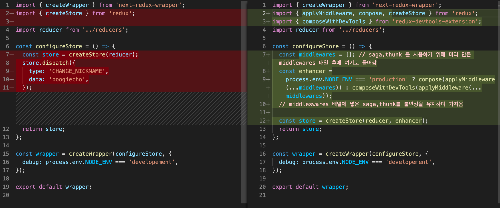
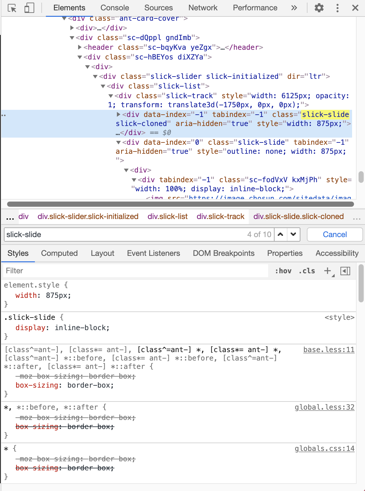
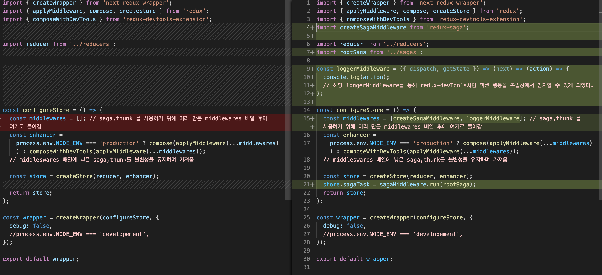

# 어디서나 적용가능한 front 구성하기

클론 코딩을 따라치면서, 따라할 때는 이해가 가는데, 막상 만들려니깐 어디서부터 시작할 지 모르겠는 나를 위한 계획서입니다.
SSR까지 쭉 download한 dependencies를 바탕으로 어떤 작업을 했는지 작성해 나갈 예정입니다.

## 1. 📁 downloaded dependencies

- @ant-design/icons
- antd
- next
- prop-types
- react
- react-dom
- styled-components

🌟 초기 설정 및 페이지만 나누기/ eslint로 기본적인 프로그래밍 규율 만들기 🌟

## 2. 📁 downloaded dependencies

- eslint
- eslint-plugin-import
- eslint-plugin-react
- eslint-plugin-react-hook

🌟 공통 레이아웃인 App Layout으로 그리드 나누고, 디자인하기 (postcard 등) 🌟

```
xs = 모바일
sm = 태블릿
md = 작은 데스크탑
https://ant.design/components/grid/

페이지를 구성할 때는 모바일 > pc 순으로 만들것!

24가 Full page의 기준이다.
6 / 12 / 6 을 통해 25 : 50 : 25 의 비율로 화면을 구성한다는 것을 의미한다.
gutter는 <Col> 끼리 붙지 않도록 Col 사이의 간격(padding)을 주는 것이다.
```

<hr/>
🌟 antd 커스터마이징하기!🌟
파일이 빌드시 크지 않다는 전제하에 (1MB 이하) 인라인 태그로도 커버가 가능하지만 더 커질 경우 useMemo 또는 styled-component로 인라인 스타일링 된 태그들을 바꿔주는 것이 성능 최적화에 도움이 된다.

```js
case 1 !

const SearchInput = styled(Input.Search)`
  vertical-align: middle;
`;

antd로 제공받은 컴포넌트를 styled 컴포넌트로 styling하기
```

```js
case 2 !

const style = useMemo(() =>  ({vertical-align: middle}), []);

후에 style을 속성으로 넣어준다. style={style}
```

<hr/>

🌟 프로필 페이지관련 작업 📁pages/profile 🌟

- followList / followerList 만들기
  > https://ant.design/components/list/
- NikcnameEditForm 만들기

## 3. 📁 downloaded dependencies

- redux
- react-redux
- next-redux-wrapper

<p>
비동기를 처리할 때는 기본적으로 Context API, redux, mobX등 을 사용하는데, 과정은 보통 3단계로 나눠져있다.
비동기 처리에서는 요청 > 성공 or 실패 의 과정을 반복하게 되는데, 이 과정을 context api로 하나하나 만들기 보다 redux를 사용하여 정형화된 상태로 구현이 가능하다. 또한 리덕스 관련 확장프로그램(redux-devtools) 등을 통해 redux는 history 추적이 용이하다는 장점이 있어 redux를 많이 사용하는 편이다.
</p>

🌟 nextjs에 redux 적용하기 🌟

<p>

기본적으로 redux를 다운받고 pages 전체를 활용하기 위해 \_app.js를 hoc로 덮어씌우는 📁store/configureStore 에 next-redux-wrapper를 사용한다.

</p>

<h2>store 만들기</h2>

```js
import { createWrapper } from 'next-redux-wrapper';
import { createStore } from 'redux';

import reducer from '../reducers';

const configureStore = () => {
  const store = createStore(reducer);
  return store;
};

const wrapper = createWrapper(configureStore, {
  debug: process.env.NODE_ENV === 'developement',
});

export default wrapper;
```

<h2>reducer 만들기</h2>
<p>
리듀서는 react에서 사용했던 방식을 그대로 사용한다. 전체적으로 상태관리를 하는 rootReducer와 초기 상태를 지정하는 initialState 변수가 있다. 컴포넌트 들에서 요청(액션)을 보내면 그 액션을 파악하고 rootReducer로 넘겨주어, 리듀서에서 리턴된 값을 다시 해당 컴포넌트로 반환하는 과정을 거친다. 리듀서는 항상 수동적으로 작동하는 것을 잊지말아야 한다.
</p>

```js
const initialState = {
  name: 'junhee',
  age: 25,
  pw: 'babo',
};

const changeNickName = (data) => {
  return {
    type: 'CHANGE_NICKNAME',
    data,
  };
};

changeNickName('boogiejun');

const rootReducer = (state = initialState, action) => {
  switch (action.type) {
    case 'CHANGE_NICKNAME':
      return {
        ...state,
        name: action.data,
      };
    default:
      return { state };
  }
};

export default rootReducer;
```

<p>
changeNickName()에 'boogiejun'이라는 파라미터가 들어가 발생하면, changeNickName() 함수가 발생하면서 바꾸고자 하는 객체의 속성 { name }에 접근한다. 루트 리듀서에서 'CHANGE_NICKNAME'을 받아와 기존 상태(...state)를 유지하고 바꾸자고 하는 속성 name만 들어오는 action.data(boogiejun)으로 바꿔준다. 이를 리턴하고, virtualDOM이 변화된 상태를 감지하여 컴포넌트를 리렌더링하여 사용자가 보게 된다.
</p>

## 4. 📁 downloaded dependencies

- redux-devtools-extension

🌟 redux에 미들웨어, HYDRATE 적용하기 🌟

<p> 우리는 nextjs의 SSR의 장점을 활용하기 위해 HYDRATE를, redux-devtools로 redux-saga/ reducer의 데이터를 추적하기 위해 미들웨어를 추가적으로 구성합니다.</p>

```js
const rootReducer = (state = initialState, action) => {
  switch (action.type) {
    case HYDRATE:
      console.log('HYDRATE : ', action);
      return { ...state, ...action.payload };
    case LOG_IN:
      ...
      ...
    default state;
  }
```

<p>📁reducers/index의 rootReducer case에 HYDRATE를 추가합니다. 또한 configureStore도 미들웨어 사용 준비를 거칩니다.</p>

<p>store에 추가한 enhancer를 통해 우리는 redux-devTools를 사용할 수 있습니다. production 즉 배포 상태에서는 사용하지 않지만, production 상태가 아닐 떄(개발상태)는 redux-devTools를 사용하여 state를 추적합니다. middleWares에는 saga/thunk를 추가적으로 넣어 redux를 확장하는 미들웨어를 선언할 것입니다.</p>

🌟 antd <-> styled-component 응용하기 🌟

```js
const ButtonRed = styled(Button)`
  background-color: salmon;
  color: white;
  border: none;

  &:hover {
    border: 1px solid salmon;
    color: salmon;
  }
`;
```

<p> 
기존의 import {Button} from 'antd'를 통헤 블라온 버튼 컴포넌트에 스타일드 컴포넌트로 스타일링하는 과정이다. ( & ) 연산자를 사용하여 기존에 class, id 와 같은 document 선택자에 접근하여 스타일링을 해줄 수 있다. 
</p>

🌟 리듀서 쪼개기 🌟

<p> 처음 프론트엔드 코드를 작성할 때, 우리는 간단하게 reducer의 원리만 알아보는 index 리듀서에 모든 기능을 작성하여 시험해봤다. 하지만 리덕스사가 및 리듀서를 사용하여 코드를 진행하면서 불가피하게 길어질 코드를 관리하기 위해서 reducer를 user/ post 리듀서로 나눠주었다.</p>

```js
import { HYDRATE } from 'next-redux-wrapper';
import { combineReducers } from 'redux';
import user from './user';
import post from './post';

const rootReducer = combineReducers({
  index: (state = {}, action) => {
    switch (action.type) {
      case HYDRATE:
        console.log('HYDRATE : ', action);
        return { ...state, ...action.payload };
      default:
        return { state };
    }
  },
  user,
  post,
});

export default rootReducer;
```

<p>위 커밋으로 되돌아와 이전의 나눠지기 전의 코드와 비교해보면 어느 부분이 바뀌었는 지 쉽게 알 수 있다. rootReducer는 redux의 combineReducers를 이용하여 쪼개주었고, initialState도 각각 user 리듀서와 post 리듀서로 나누어 들어갔다.</p>

```js
// reducer를 나누기 전 index에 몰아넣은 user/ post 객체
const initialState = {
  user: {
    isLoggedIn: false,
    user: null,
    signUpData: {},
    loginData: {},
  },
  post: {
    mainPosts: [],
  },
};
```

<p>원래 user.isLoggedIn에 접근하기 위해서는 기존의 불변성을 지켜줘야 하기 때문에</p>

```js
// reducer를 나누기 전 user 객체를 변화시키는 reducer의 액션 실행시의 불변성
case 'LOG_IN':
  return {
    ...state,
    user: {
      ...state.user,
      isLoggedIn: true,
      user: action.data,
    },
  };
```

<p>와 같이 불변성을 지켜서 한단계 더 내려가 isLoggedIn에 접근했다. 하지만, 리듀서를 나눠주었기 때문에 현재 user 리듀서에서는 다음과 같이 접근한다. (user 객체가 initialState이기 때문에 한 번 더 불변성을 지키며 내려갈 필요가 없어졌음)</p>

```js
// reducer를 나눈 후 user 객체를 변화시키는 reducer의 액션 실행시의 불변성
case 'LOG_IN':
  return {
    ...state,
    isLoggedIn: true,
    user: action.data,
  };
```

<hr/>

🌟 main Page 구성하기 🌟

<p>기존 강좌에서 index 페이지를 mainPosts로 구성했던 것과 달리, 접근 권한을 높이기 위해 (무분별한 서버의 접속량을 낮추기 위해서) 로그인을 index로 구성하였다. 따라서 기존의 index 페이지는 main 페이지로 대체되었다. 데이터는 reducer의 user에서 받아오기 때문에 useSelector로 관리하여 프로그래밍 상에 문제는 없음을 확인하였다. 따라서 우리는 pages/main 에서 post 리듀서의 <b>mainPosts</b>를 매핑하여 하나씩 풀어주는 <b>post</b> props를 통해 모든 정보를 주고받을 것이다.</p>

<p>PostCard를 구현하기 위해서는 처음 어떻게 구현할 지 설계를 해본다.</p>

```js
// antd 적용 전 우리가 예상하여 작성한 PostCard 컴포넌트, 넣고 싶은 기능들이 들어가있다. (image, content, button, commentform, comment)
const PostCard = ({ post }) => {
  return (
    <div>
      <Card>
        <Image />
        <Content />
        <Button></Button>
      </Card>
      <CommentForm />
      <Comments />
    </div>
  );
};
```

<p>위와 같은 형식으로 Card를 구현한다고 했을 때, antd에서 기본적으로 제공하는 속성들이 있다면, 그것을 사용하고 없다면 컴포넌트로 만들어줘야 한다.</p>

```js
// antd를 적용한 PostCard 컴포넌트

const PostCard = ({ post }) => {
  const id = useSelector((state) => state.user.me?.id);
  return (
    <div>
      <Card
        cover={post.Images[0] && <PostImages images={post.images} />}
        actions={[
          <RetweetOutlined key="retweet" />,
          <HeartOutlined key="heart" />,
          <CommentOutlined key="commet" />,
          <Popover
            key="more"
            content={
              <Button.Group>
                {id && post.User.id === id ? ((<Button>수정</Button>), (<Button type="danger">삭제</Button>)) : <Button>신고</Button>}
              </Button.Group>
            }
          >
            <EllipsisOutlined />
          </Popover>,
        ]}
      >
        <Card.Meta avatar={<Avatar>{post.User.nickname[0]}</Avatar>} title={post.User.nickname} description={post.content} />
      </Card>
      {/* <CommentForm /> */}
      {/* <Comments /> */}
    </div>
  );
};
```

<p>위의 PostCard 컴포넌트처럼 우리는 css framework를 사용하지 않더라도, 미리 넣고싶은 기능들을 상상하여 컴포넌트 형식으로 넣어놓고, 존재하는 부분은 css framework에서 참고하여 속성들을 채우고 없는 부분은 따로 컴포넌트를 더 추가하여 만들어주는 식으로 작성하면 된다. (인스타그램의 포스트카드, 트위터의 포스트카드의 레이아웃을 참고하여 구성하는 편이 하나하나 다 만드는 것보다 더 빠르고 효율적일 것)</p>

## 5. 📁 downloaded dependencies

- react-slick

🌟 PostCard의 하위 컴포넌트 postImages 구현하기 🌟

<p>styled-component에서 제공하는 createGlobalStyle을 사용하여 global하게 클래스에 css styling 작업을 할 수 있습니다. 이미 slick 라이브러리에서 만들어져 제공하는 클래스의 이름(slick-slide 라 가정,)을 대신해서 styled-component를 사용하여 이를 덮어 씌울 수 있습니다. 사용 방법은 다음과 같습니다.</p>

```js
export const Global = createGlobalStyle`
  .slick-slide{
    display: inline-block;  
  }
  .ant-card-cover{
    transform: none !important;
  }
`;
```

<p>후에 이 Global 변수를 컴포넌트 형태로 최상단에 선언하여 사용하며 (<Global/>) .slick-slide class를 덮어 씌워 우리가 만든 스타일로 들어가게 됩니다. </p>



<p> 이미지 캐루셀 형식은 직접 구현하기 보다 react-slick 과 같은 라이브러리를 사용하여 구현한다면 효과적으로 이미지 캐루셀 형식을 만들 수 있습니다. <a href="https://www.npmjs.com/package/react-slick">react-slick</a> npm 사이트에서 react-slick이 제공하는 속성들을 비교해볼 수 있습니다. <a href="https://gahyun-web-diary.tistory.com/15"> tistory</a>를 참고하여 완성도 높은 캐루셀을 만들어 봅시다. </p>

<hr/>

🌟 다이나믹 라우팅을 위한 해쉬태그(#) 분리하기 🌟

<p>nextjs를 사용하는 가장 큰 이유는 '다이나믹 라우팅을 사용한 서버사이드 렌더링을 제공하기 위해서' 라고 해도 과언이 아니다. 한 가지 동적 페이지를 통해 사용자가 원하는 데이터와 정보를 state로 관리하여 서버에서부터 사용자에게 전달될 수 있다. hashtag 또한, 후에 `[hashtag].js`와 같은 방향으로 해당 해쉬태그가 포함된 모든 게시글을 보여줄 수 있도록 만들어야 하기 때문에 일반 글과 해시태그가 포함된 게시글을 분리할 필요가 있다. 이때 정규 표현식을 사용하여 일반 글과 해쉬태그가 포함된 글을 분리할 수 있는데, 방법은 다음과 같다.</p>

```Js
const PostCardContent = ({ postData }) => (
  <div>
    {postData.split(/(#[^\s#]+)/g).map((v) => {
      if (v.match(/(#[^\s]+)/)) {
        return (
          <Link href={{ pathname: '/hashtag', query: { tag: v.slice(1) } }} as={`/hashtag/${v.slice(1)}`} key={v}>
            <a>{v}</a>
          </Link>
        );
      }
      return v;
    })}
  </div>
);
```

<p>PostCard의 하위 컴포넌트인 PostCardContent는 postData를 props로 받아와 사용한다. 이 postData에는 사용자가 입력한 글(해쉬태그 포함)이 들어있다. if 문에 따라 postData를 분리하게 되는데, 정규표현식을 통해 (#)이 포함된 문자열은 Link 태그를 포함하여 나타내고 바로 다이나믹 라우팅을 위해 `/hashtag/${v.slice(1)}`로 나타낸다. 예를 들어 `#익스프레스` 해쉬태그를 클릭하면 링크를 타고 `localhost/hashtag/익스프레스` 와 같은 방법으로 나타날 것이다. 후에 해당 해쉬태그가 들어있는 모든 게시글을 볼 수 있다. </p>
<p>
🌟<a href="https://regexr.com/">정규식 테스트 사이트</a>🌟<br/>
//g 에서 g는 global로 여러개의 문자열을 받을 수 있다. split 함수를 통해 해당 정규식이 포함된 postData만을 분리하고, 매핑하는데, slice(1)은 문자열의 맨 앞에 붙어있는 '#'을 떼주기 위함이다. 따라서 해시태그 {url/해당해시태그}를 통해 해당 해시태그가 포함된 글을 검색할 수 있게 되었다.
</p>

<h1>🌟instagram 디테일🌟</h1>
- 'postcardcontent' 최대 보여줄 수 있는 댓글 제한
- 댓글 특정 갯수 이상 달릴 때, 스크롤 적용
- 좋아요 n 개 갯수 표시
- 프로필 이미지 설정하기

## 6. 📁 downloaded dependencies

- axios
- redux-saga

<p>redux-saga는 리덕스의 미들웨어로 주어지는 상황(액션)에 대해 비동기적으로 다음 행동을 할 수 있는 함수를 제공한다. <a href="https://github.com/junh0328/redux-saga">깃허브 공식문서</a>를 통해 더 자세한 사용방법을 알아볼 수 있다. 사용법은 기존 강의를 통해서 공부했으므로, 적용법에 대해서만 남겨보고자 한다. redux-saga는 리덕스의 미들웨어이므로 📁store/configureStore.js 에서 만들었던 변수 middleWares= [...] 에 redux-saga를 넣어 적용가능하다. 적용한 코드는 다음과 같다.</p>



🌟 📁sagas/index 로 redux-saga 처음 적용하기 🌟

<p> redux-saga 와 같은 비동기 함수 미들웨어를 적용하는 근본적인 이유는 무엇일까? 아마도 사용자가 서버로 요청을 ('~ 해줘, 불러와줘, ... ') 보낼 때, 프론트 서버에서 이 사용자의 요청을 감지(watch)하여 서버로 보내고(api) 결과값을 서버로부터 받는(put) 과정을 진행하기 위해서이다. 이러한 과정들에 들어가는 함수들을 기본적으로 제공한다는 것이 리덕스 사가의 제일 큰 장점이다. 따라서 공식문서에서 제공하는 방향에 따라 함수를 설계해야 한다.
</p>

🌟 로그인 API로 사가 알아보기 🌟

```js
import all, { call, fork, put, take } from 'redux-saga/effects';
import axios from 'axios';

function loginAPI(data) {
  return axios.post('/api/login', data);
}

function* logIn(action) {
  try {
    const result = yield call(loginAPI, action.data);
    yield put({
      type: 'LOG_IN_SUCCESS',
      data: result.data,
    });
  } catch (err) {
    yield put({
      type: 'LOG_IN_FAIULURE',
      data: err.response.data,
    });
  }
}

function* watchLogin() {
  yield take('LOG_IN_REQUEST', logIn);
}

export default function* rootSaga() {
  yield all([fork(watchLogin)]);
}
```

- 1. 먼저 export 한 rootSaga를 통해 모든 요청(all)을 감지할 수 있도록 한다(fork).
- 2. 요청을 감지할 수 있는 watchLogin()함수를 만들고, 해당 요청 ('LOGIN_IN_REQUEST')이 사용자로부터 넘어오면, logIn 함수를 실행시킨다.
- 3. 로그인 함수에서는 'LOG_IN_REQUEST'를 통해 사용자가 보내고자하는 데이터(payload)를 action으로 받아 와 이 데이터를 loginAPI에게 넘겨주고 결과 값을 result 변수에 담는다.
- 4. result 변수는 백엔드에서 처리되어 넘어오는 결과에 따라 'LOG_IN_SUCCESS' 또는 'LOG_IN_FAILURE' 함수를 반환하여 사용자에게 전달한다.
- 5. 이 과정들은 모두 generator 함수(function\*)를 통해 하나하나 끊겨 작동하기 때문에 redux-devtools로 관리할 수 있고, 추적에 용이하다.
- 6. 'LOG_IN_SUCCESS'와 같은 액션들은 모두 리듀서에 만들어 import 하여 사용하게 된다.

<h2> 🌟 next-redux-saga를 적용한 것이 아니기 때문에, 따로 hoc를 적용하여 \_app.js를 추가적으로 덮어씌울 필요는 없다. 🌟</h2>

🌟 saga의 이펙트 (effects) 🌟

<p> 처음 배울 때 yield 뒤에 변수값을 받아 오거나, 조건 문을 통해 문장을 제어하였는데, saga를 활용하기 위해서는 이펙트들을 잘 활용해야 한다. </p>

|           값           |                                                         의미                                                         |
| :--------------------: | :------------------------------------------------------------------------------------------------------------------: |
|        all([ ])        |                 yield에서 배열을 받는다. 그 배열안에 들어있는 함수(fork, call)를 한번에 실행해준다.                  |
|        fork( )         | 함수를 실행한다. (비동기 함수 호출), 요청을 보내고 결과와 상관없이 바로 다음 함수로 넘어간다. (블로킹을 하지않는다.) |
|        call( )         |       함수를 실행한다. (동기 함수 호출), 리턴 받을 때까지 기다렸다가 리턴 받은 값을 넣어준다. (블로킹을 한다.)       |
| take("ACTION", action) |    'ACTION' 이라는 액션이 실행될 때까지 기다리겠다. 'ACTION'이 실행되면, action이라는 generator 함수를 실행한다.     |
|        put({ })        |                            액션 객체를 실행시킨다. (redux의 dispatch와 같은 행동을 한다)                             |
|        delay()         |   백엔드 구현 전에, 더미데이터를 통해 데이터를 주고 받지 않고 일정 지연시간만 주고 처리하고 싶을 때 사용하는 함수    |

<p> yield 는 async/ await의 await과 비슷하다고 생각하면 쉽다. </p>

🌟 saga의 이펙트 재 반복성 (take) 🌟

<p>
yield를 통해 take() 함수들을 감싸다보니 생기는 가장 큰 문제는 해당 함수를 한 번 밖에 실행하지 못한다는 것이다.🌟 띠리사 generator의 특성을 활용하여 yield로 만든 해당 함수들을 while true 문으로 감싸줘야 한다! 🌟 while true와 같이 모든 함수를 감싸주게 되면 코드의 양이 늘어나므로 takeEvery()라는 함수를 기존 take() 대신 사용한다.
</p>

|               값               |                                                                      의미                                                                      |
| :----------------------------: | :--------------------------------------------------------------------------------------------------------------------------------------------: |
|          takeEvery()           |                      yield take()를 대신해서 모든 상황에서 take를 계속 받을 수 있는 함수, while true의 역할을 대신 한다.                       |
|          takeLatest()          |                            이벤트의 실행이 두 번 혹은 연속적으로 실행됐을 때, 최종적으로 클릭한 액션을 넘겨받는다.                             |
| throttle("ACTION", action, 초) | takeLatest()의 한계(요청을 시간 차로 보냈을 때는 두 요청 모두를 처리)를 보완하기 위해서 일정 시간동안 보낼 수 있는 요청의 갯수를 제한하는 함수 |

<p>
보통은 takeLatest()를 많이 사용한다. 하지만, takeLatest()를 통해 프론트에서는 최종적으로 마지막 액션을 보여준다고 하더라도, 백에서는 해당 요청에 따라 응답을 두 번 할수 있다. 응답은 취소할 수 있지만, 요청을 취소할 수는 없다. 따라서 throttle() 을 사용하여 요청을 제한하기도 한다.(대부분의 경우는 takeLatest()를 쓴다.)
</p>
<hr/>

<h2> 🌟 그럼 프론트에서만 구성하면 사가를 어떻게 확인하나요? 🌟 </h2>

<p>간단하게 saga의 login function을 살펴 보자</p>

```js
function loginAPI(data) {
  return axios.post('/api/login', data);
}

function* logIn(action) {
  try {
    const result = yield call(loginAPI, action.data);
    yield put({
      type: 'LOG_IN_SUCCESS',
      data: result.data,
    });
  } catch (err) {
    yield put({
      type: 'LOG_IN_FAIULURE',
      data: err.response.data,
    });
  }
}
```

<p>watchLogIN을 통해 감지된 사용자의 요청이 logIn 함수를 발생시키면, action.data(사용자가 요청 보낸 이메일 패스워드가 담겨잇겠죠?)를 loginAPI로 보내고 결과를 반환받을 때까지 기다린다(call 함수에 의해), 하지만 front와 backend 작업을 따로 진행한다면 백엔드에 위 action.data를 보내줄 수 없기 때문에 delay 함수를 이용하여 성공된 결과를 반환하는 형식으로 미리 구성해본다.
</p>

```js
function loginAPI(data) {
  return axios.post('/api/login', data);
}

function* logIn(action) {
  try {
    // const result = yield call(loginAPI, action.data);
    yield delay(2000);
    yield put({
      type: 'LOG_IN_SUCCESS',
      data: result.data,
    });
  } catch (err) {
    yield put({
      type: 'LOG_IN_FAIULURE',
      data: err.response.data,
    });
  }
}
```

<p>loginAPI는 자동적으로 실행되지 않을 것이고, try catch문에 의해 감싸져 있으므로 action은 2초 뒤에 LOG_IN_SUCCESS 함수를 실행(put)시킬 것이다. 이 delay 함수를 통해 마치 백엔드와 소통하여 데이터를 성공적으로 반환받은 효과를 낼 수 있다.</p>
