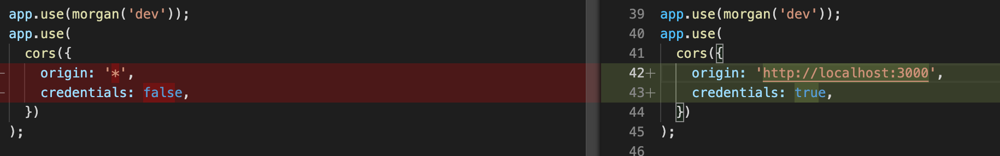
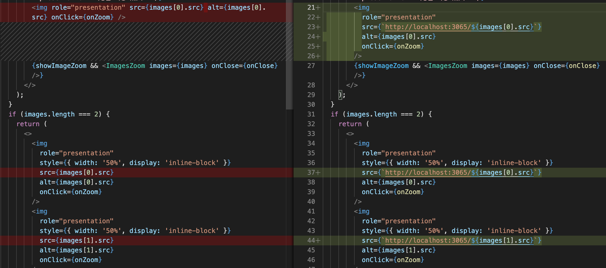
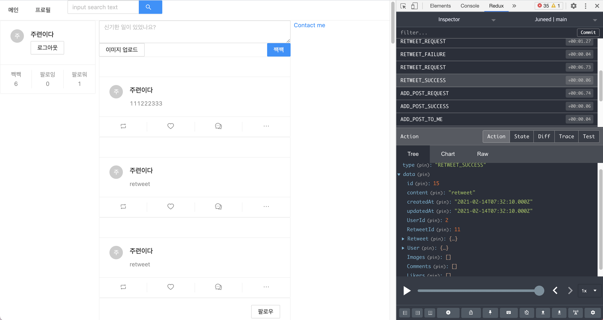
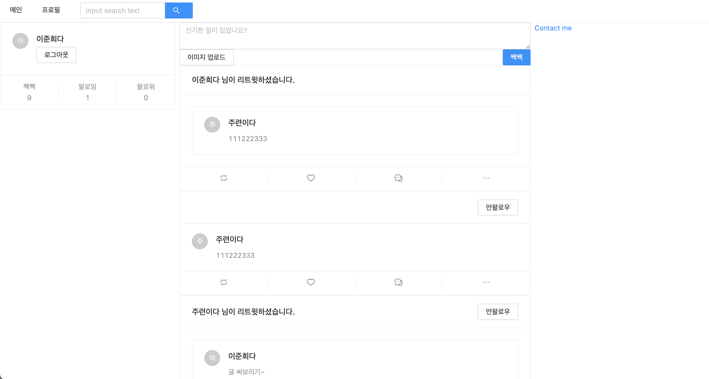
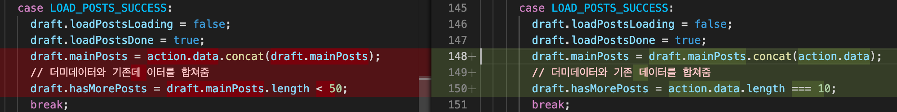
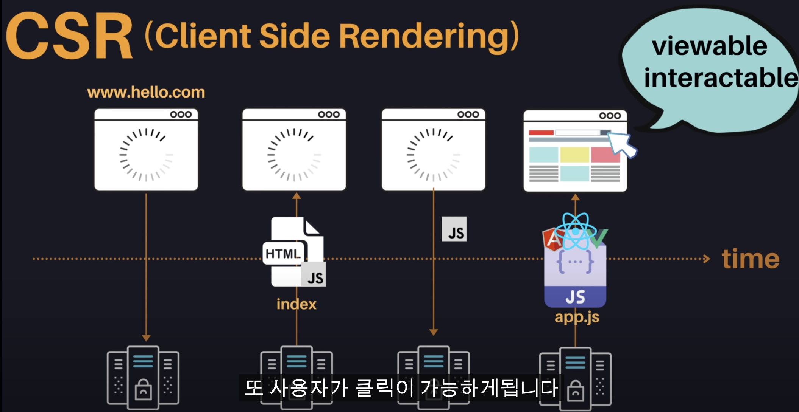
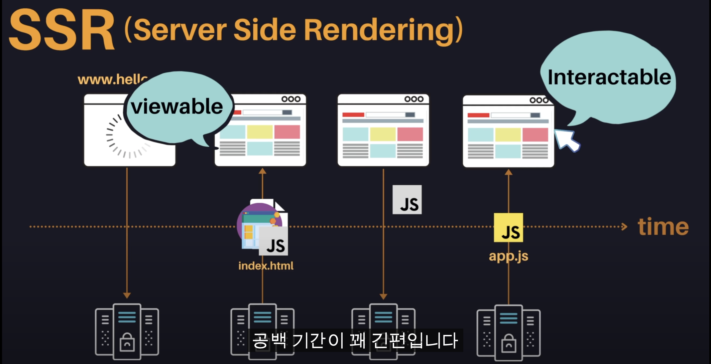
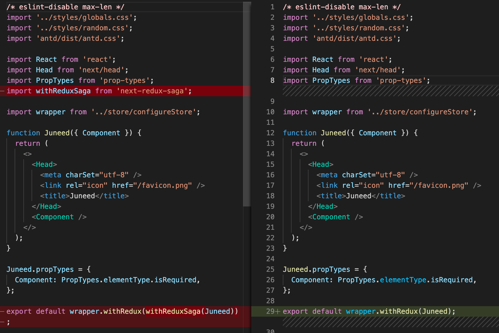
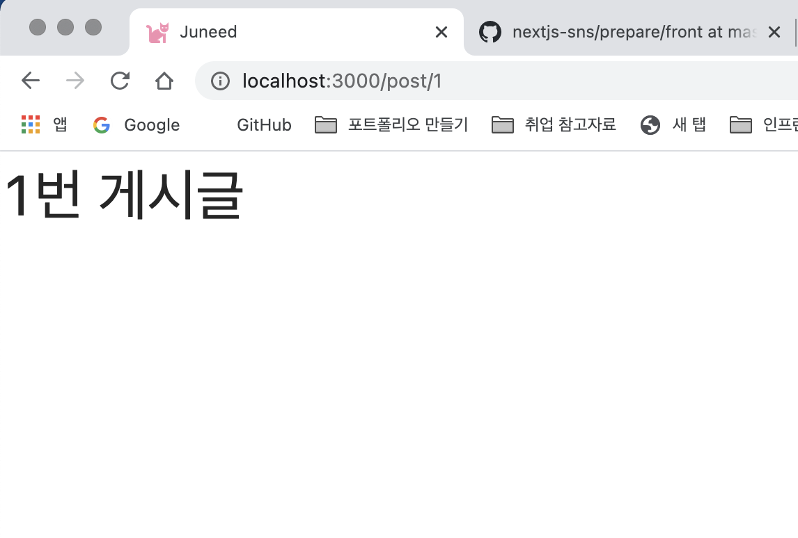
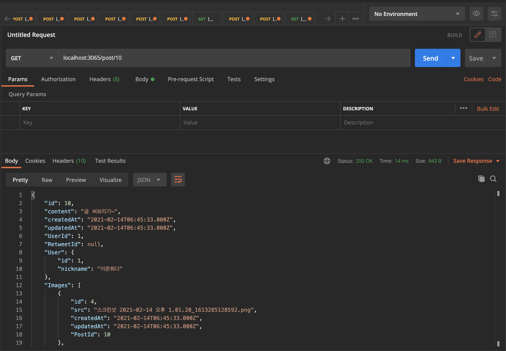

# 어디서나 적용가능한 front 구성하기

클론 코딩을 따라 치면서, 따라칠 때는 분명 이해가 갔는데, 막상 기획하여 만들려니깐 어디서부터 시작할 지 모르겠는 주니어 개발자를 위한 계획서입니다.
antd 적용부터 리액트 핵심 기술인 SSR까지 download한 dependencies를 바탕으로 어떤 작업을 했는지 작성해 나갈 예정입니다. <a href="https://nextjs.org/" target="_blank">next.js</a> 프레임워크를 사용하여 서비스를 계획중이기 때문에, 공식 문서를 보고 오는 것을 추천합니다. <a href="https://github.com/junh0328/nextjs_org/tree/master/nextjs-blog" target="_blank">저의 깃허브</a>에도 공식문서를 바탕으로 작성한 readme.md 파일이 있으니 참고하시고 부족한 부분이나 해석이 잘못된 부분은 pull request를 통해 알려주시면 바로바로 참고하여 고치겠습니다.

## 1. 📁 downloaded dependencies

- @ant-design/icons
- antd
- next
- prop-types
- react
- react-dom
- styled-components

<h2>🌟 초기 설정 및 페이지만 나누기/ eslint로 기본적인 프로그래밍 규율 만들기 🌟</h2>

## 2. 📁 downloaded dependencies

- eslint
- eslint-plugin-import
- eslint-plugin-react
- eslint-plugin-react-hook

<h2>🌟 공통 레이아웃인 App Layout으로 그리드 나누고, 디자인하기 (postcard 등) 🌟 </h2>

```
xs = 모바일
sm = 태블릿
md = 작은 데스크탑
https://ant.design/components/grid/

페이지를 구성할 때는 모바일 > pc 순으로 만들것!

24가 Full page의 기준이다.
6 / 12 / 6 을 통해 25 : 50 : 25 의 비율로 화면을 구성한다는 것을 의미한다.
gutter는 <Col> 끼리 붙지 않도록 Col 사이의 간격(padding)을 주는 것이다.
```

<hr/>
<h2>🌟 antd 커스터마이징하기!🌟</h2>
파일이 빌드시 크지 않다는 전제하에 (1MB 이하) 인라인 태그로도 커버가 가능하지만 더 커질 경우 useMemo 또는 styled-component로 인라인 스타일링 된 태그들을 바꿔주는 것이 성능 최적화에 도움이 된다.

```js
case 1 !

const SearchInput = styled(Input.Search)`
  vertical-align: middle;
`;

antd로 제공받은 컴포넌트를 styled 컴포넌트로 styling하기
```

```js
case 2 !

const style = useMemo(() =>  ({vertical-align: middle}), []);

후에 style을 속성으로 넣어준다. style={style}
```

<hr/>

<h2>🌟 프로필 페이지관련 작업 📁pages/profile 🌟</h2>

- followList / followerList 만들기
  > https://ant.design/components/list/
- NikcnameEditForm 만들기

## 3. 📁 downloaded dependencies

- redux
- react-redux
- next-redux-wrapper

<p>
비동기를 처리할 때는 기본적으로 Context API, redux, mobX등 을 사용하는데, 과정은 보통 3단계로 나눠져있다.
비동기 처리에서는 요청 > 성공 or 실패 의 과정을 반복하게 되는데, 이 과정을 context api로 하나하나 만들기 보다 redux를 사용하여 정형화된 상태로 구현이 가능하다. 또한 리덕스 관련 확장프로그램(redux-devtools) 등을 통해 redux는 history 추적이 용이하다는 장점이 있어 redux를 많이 사용하는 편이다.
</p>

<h2>🌟 nextjs에 redux 적용하기 🌟</h2>

<p>

기본적으로 redux를 다운받고 pages 전체를 활용하기 위해 \_app.js를 hoc로 덮어씌우는 📁store/configureStore 에 next-redux-wrapper를 사용한다.

</p>

<h2>store 만들기</h2>

```js
import { createWrapper } from 'next-redux-wrapper';
import { createStore } from 'redux';

import reducer from '../reducers';

const configureStore = () => {
  const store = createStore(reducer);
  return store;
};

const wrapper = createWrapper(configureStore, {
  debug: process.env.NODE_ENV === 'developement',
});

export default wrapper;
```

<h2>reducer 만들기</h2>
<p>
리듀서는 react에서 사용했던 방식을 그대로 사용한다. 전체적으로 상태관리를 하는 rootReducer와 초기 상태를 지정하는 initialState 변수가 있다. 컴포넌트 들에서 요청(액션)을 보내면 그 액션을 파악하고 rootReducer로 넘겨주어, 리듀서에서 리턴된 값을 다시 해당 컴포넌트로 반환하는 과정을 거친다. 리듀서는 항상 수동적으로 작동하는 것을 잊지말아야 한다.
</p>

```js
const initialState = {
  name: 'junhee',
  age: 25,
  pw: 'babo',
};

const changeNickName = (data) => {
  return {
    type: 'CHANGE_NICKNAME',
    data,
  };
};

changeNickName('boogiejun');

const rootReducer = (state = initialState, action) => {
  switch (action.type) {
    case 'CHANGE_NICKNAME':
      return {
        ...state,
        name: action.data,
      };
    default:
      return { state };
  }
};

export default rootReducer;
```

<p>
changeNickName()에 'boogiejun'이라는 파라미터가 들어가 발생하면, changeNickName() 함수가 발생하면서 바꾸고자 하는 객체의 속성 { name }에 접근한다. 루트 리듀서에서 'CHANGE_NICKNAME'을 받아와 기존 상태(...state)를 유지하고 바꾸자고 하는 속성 name만 들어오는 action.data(boogiejun)으로 바꿔준다. 이를 리턴하고, virtualDOM이 변화된 상태를 감지하여 컴포넌트를 리렌더링하여 사용자가 보게 된다.
</p>

## 4. 📁 downloaded dependencies

- redux-devtools-extension

<h2>🌟 redux에 미들웨어, HYDRATE 적용하기 🌟</h2>

<p> 우리는 nextjs의 SSR의 장점을 활용하기 위해 HYDRATE를, redux-devtools로 redux-saga/ reducer의 데이터를 추적하기 위해 미들웨어를 추가적으로 구성합니다.</p>

```js
const rootReducer = (state = initialState, action) => {
  switch (action.type) {
    case HYDRATE:
      console.log('HYDRATE : ', action);
      return { ...state, ...action.payload };
    case LOG_IN:
      ...
      ...
    default state;
  }
```

<p>📁reducers/index의 rootReducer case에 HYDRATE를 추가합니다. 또한 configureStore도 미들웨어 사용 준비를 거칩니다.</p>
<hr/>
<p>📁store/configureStore에서 추가한 변수 <b>enhancer</b>를 통해 우리는 redux-devTools를 사용할 수 있습니다. production, 즉 배포 상태에서는 사용하지 않지만, production 상태가 아닐 떄(개발상태)는 redux-devTools를 사용하여 state를 추적합니다. middleWares에는 saga/thunk를 추가적으로 넣어 redux를 확장하는 미들웨어를 선언할 것입니다.</p>


<hr/>

<h2>🌟 antd <-> styled-component 응용하기 🌟</p>

```js
const ButtonRed = styled(Button)`
  background-color: salmon;
  color: white;
  border: none;

  &:hover {
    border: 1px solid salmon;
    color: salmon;
  }
`;
```

<p> 
기존의 import {Button} from 'antd'를 통헤 블라온 버튼 컴포넌트에 스타일드 컴포넌트로 스타일링하는 과정이다. ( & ) 연산자를 사용하여 기존에 class, id 와 같은 document 선택자에 접근하여 스타일링을 해줄 수 있다. 
</p>

<h2>🌟 리듀서 쪼개기 🌟</h2>

<p> 처음 프론트엔드 코드를 작성할 때, 우리는 간단하게 reducer의 원리만 알아보는 index 리듀서에 모든 기능을 작성하여 시험해봤다. 하지만 리덕스사가 및 리듀서를 사용하여 코드를 진행하면서 불가피하게 길어질 코드를 관리하기 위해서 reducer를 user/ post 리듀서로 나눠주었다.</p>

```js
import { HYDRATE } from 'next-redux-wrapper';
import { combineReducers } from 'redux';
import user from './user';
import post from './post';

const rootReducer = combineReducers({
  index: (state = {}, action) => {
    switch (action.type) {
      case HYDRATE:
        console.log('HYDRATE : ', action);
        return { ...state, ...action.payload };
      default:
        return { state };
    }
  },
  user,
  post,
});

export default rootReducer;
```

<p>위 커밋으로 되돌아와 이전의 나눠지기 전의 코드와 비교해보면 어느 부분이 바뀌었는 지 쉽게 알 수 있다. rootReducer는 redux의 combineReducers를 이용하여 쪼개주었고, initialState도 각각 user 리듀서와 post 리듀서로 나누어 들어갔다.</p>

```js
// reducer를 나누기 전 index에 몰아넣은 user/ post 객체
const initialState = {
  user: {
    isLoggedIn: false,
    user: null,
    signUpData: {},
    loginData: {},
  },
  post: {
    mainPosts: [],
  },
};
```

<p>원래 user.isLoggedIn에 접근하기 위해서는 기존의 불변성을 지켜줘야 하기 때문에</p>

```js
// reducer를 나누기 전 user 객체를 변화시키는 reducer의 액션 실행시의 불변성
case 'LOG_IN':
  return {
    ...state,
    user: {
      ...state.user,
      isLoggedIn: true,
      user: action.data,
    },
  };
```

<p>와 같이 불변성을 지켜서 한단계 더 내려가 isLoggedIn에 접근했다. 하지만, 리듀서를 나눠주었기 때문에 현재 user 리듀서에서는 다음과 같이 접근한다. (user 객체가 initialState이기 때문에 한 번 더 불변성을 지키며 내려갈 필요가 없어졌음)</p>

```js
// reducer를 나눈 후 user 객체를 변화시키는 reducer의 액션 실행시의 불변성
case 'LOG_IN':
  return {
    ...state,
    isLoggedIn: true,
    user: action.data,
  };
```

<hr/>

<h2>🌟 main Page 구성하기 🌟</h2>

<p>기존 강좌에서 index 페이지를 mainPosts로 구성했던 것과 달리, 접근 권한을 높이기 위해 (무분별한 서버의 접속량을 낮추기 위해서) 로그인을 index로 구성하였다. 따라서 기존의 index 페이지는 main 페이지로 대체되었다. 데이터는 reducer의 user에서 받아오기 때문에 useSelector로 관리하여 프로그래밍 상에 문제는 없음을 확인하였다. 따라서 우리는 pages/main 에서 post 리듀서의 <b>mainPosts</b>를 매핑하여 하나씩 풀어주는 <b>post</b> props를 통해 모든 정보를 주고받을 것이다.</p>

<p>PostCard를 구현하기 위해서는 처음 어떻게 구현할 지 설계를 해본다.</p>

```js
// antd 적용 전 우리가 예상하여 작성한 PostCard 컴포넌트, 넣고 싶은 기능들이 들어가있다. (image, content, button, commentform, comment)
const PostCard = ({ post }) => {
  return (
    <div>
      <Card>
        <Image />
        <Content />
        <Button></Button>
      </Card>
      <CommentForm />
      <Comments />
    </div>
  );
};
```

<p>위와 같은 형식으로 Card를 구현한다고 했을 때, antd에서 기본적으로 제공하는 속성들이 있다면, 그것을 사용하고 없다면 컴포넌트로 만들어줘야 한다.</p>

```js
// antd를 적용한 PostCard 컴포넌트

const PostCard = ({ post }) => {
  const id = useSelector((state) => state.user.me?.id);
  return (
    <div>
      <Card
        cover={post.Images[0] && <PostImages images={post.images} />}
        actions={[
          <RetweetOutlined key="retweet" />,
          <HeartOutlined key="heart" />,
          <CommentOutlined key="commet" />,
          <Popover
            key="more"
            content={
              <Button.Group>
                {id && post.User.id === id ? (
                  ((<Button>수정</Button>), (<Button type="danger">삭제</Button>))
                ) : (
                  <Button>신고</Button>
                )}
              </Button.Group>
            }
          >
            <EllipsisOutlined />
          </Popover>,
        ]}
      >
        <Card.Meta
          avatar={<Avatar>{post.User.nickname[0]}</Avatar>}
          title={post.User.nickname}
          description={post.content}
        />
      </Card>
      {/* <CommentForm /> */}
      {/* <Comments /> */}
    </div>
  );
};
```

<p>위의 PostCard 컴포넌트처럼 우리는 css framework를 사용하지 않더라도, 미리 넣고 싶은 기능들을 상상하여 컴포넌트 형식으로 넣어놓고, 존재하는 부분은 css framework에서 참고하여 속성들을 채웁니다. 없는 부분은 따로 컴포넌트를 더 추가하여 만들어주는 식으로 작성하면 됩니다. (인스타그램의 포스트카드, 트위터의 포스트카드의 레이아웃을 참고하여 구성하는 편이 하나하나 다 만드는 것보다 더 빠르고 효율적일 것)</p>

## 5. 📁 downloaded dependencies

- react-slick

<h2>🌟 PostCard의 하위 컴포넌트 postImages 구현하기 🌟</h2>

<p>styled-component에서 제공하는 createGlobalStyle을 사용하여 global하게 클래스에 css styling 작업을 할 수 있습니다. 이미 slick 라이브러리에서 만들어져 제공하는 클래스의 이름(slick-slide 라 가정,)을 대신해서 styled-component를 사용하여 이를 덮어 씌울 수 있습니다. 사용 방법은 다음과 같습니다.</p>

```js
import styled, { createGlobalStyle } from 'styled-components';

...

export const Global = createGlobalStyle`
  .slick-slide{
    display: inline-block;
  }
  .ant-card-cover{
    transform: none !important;
  }
`;
```

<p>후에 이 Global 변수를 컴포넌트 형태로 최상단에 선언하여 사용하며 (<Global/>) .slick-slide class를 덮어 씌워 우리가 만든 스타일로 들어가게 됩니다. </p>


<p> 이미지 캐루셀 형식은 직접 구현하기 보다 react-slick 과 같은 라이브러리를 사용하여 구현한다면 효과적으로 이미지 캐루셀 형식을 만들 수 있습니다. <a href="https://www.npmjs.com/package/react-slick">react-slick</a> npm 사이트에서 react-slick이 제공하는 속성들을 비교해볼 수 있습니다. <a href="https://gahyun-web-diary.tistory.com/15"> tistory</a>를 참고하여 완성도 높은 캐루셀을 만들어 봅시다. </p>

<hr/>

<h2>🌟 다이나믹 라우팅을 위한 해쉬태그(#) 분리하기 🌟</h2>

<p>nextjs를 사용하는 가장 큰 이유는 '다이나믹 라우팅을 사용한 서버사이드 렌더링을 제공하기 위해서' 라고 해도 과언이 아니다. 한 가지 동적 페이지를 통해 사용자가 요청하는 데이터와 정보를 state로 관리하여 서버로부터 사용자에게로 전달될 수 있다. hashtag 또한, 후에 `[hashtag].js`와 같은 방향으로 해당 해쉬태그가 포함된 모든 게시글을 보여줄 수 있도록 만들어야 하기 때문에 일반 글과 해시태그가 포함된 게시글을 분리할 필요가 있다. 이때 정규 표현식을 사용하여 일반 문자열과 해쉬태그가 포함된 문자열을 분리할 수 있는데, 방법은 다음과 같다.</p>

```Js
const PostCardContent = ({ postData }) => (
  <div>
    {postData.split(/(#[^\s#]+)/g).map((v) => {
      if (v.match(/(#[^\s]+)/)) {
        return (
          <Link href={{ pathname: '/hashtag', query: { tag: v.slice(1) } }} as={`/hashtag/${v.slice(1)}`} key={v}>
            <a>{v}</a>
          </Link>
        );
      }
      return v;
    })}
  </div>
);
```

<p>PostCard의 하위 컴포넌트인 PostCardContent는 postData를 props로 받아와 사용한다. 이 postData에는 사용자가 입력한 글(해쉬태그 포함)이 들어있다. if 문에 따라 postData를 분리하게 되는데, 정규표현식을 통해 (#)이 포함된 문자열은 Link 태그를 포함하여 나타내고 바로 다이나믹 라우팅을 위해 `/hashtag/${v.slice(1)}`로 나타낸다. 예를 들어 `#익스프레스` 해쉬태그를 클릭하면 링크를 타고 `localhost/hashtag/익스프레스` 와 같은 방법으로 나타날 것이다. 후에 해당 해쉬태그가 들어있는 모든 게시글을 볼 수 있다. </p>
<p>
🌟<a href="https://regexr.com/">정규식 테스트 사이트</a>🌟<br/>
//g 에서 g는 global로 여러개의 문자열을 받을 수 있다. split 함수를 통해 해당 정규식이 포함된 postData만을 분리하고, 매핑하는데, slice(1)은 문자열의 맨 앞에 붙어있는 '#'을 떼주기 위함이다. 따라서 해시태그 {url/해당해시태그}를 통해 해당 해시태그가 포함된 글을 검색할 수 있게 되었다.
</p>

<h1>🌟instagram 디테일🌟</h1>
- 'postcardcontent' 최대 보여줄 수 있는 댓글 제한
- 댓글 특정 갯수 이상 달릴 때, 스크롤 적용
- 좋아요 n 개 갯수 표시
- 프로필 이미지 설정하기

## 6. 📁 downloaded dependencies

- axios
- redux-saga

<p>redux-saga는 리덕스의 미들웨어로 주어지는 상황(액션)에 대해 비동기적으로 다음 행동을 할 수 있는 함수를 제공한다. <a href="https://github.com/junh0328/redux-saga">깃허브 공식문서</a>를 통해 더 자세한 사용방법을 알아볼 수 있다. 사용법은 기존 강의를 통해서 공부했으므로, 적용법에 대해서만 남겨보고자 한다. redux-saga는 리덕스의 미들웨어이므로 📁store/configureStore.js 에서 만들었던 변수 middleWares= [...] 에 redux-saga를 넣어 적용가능하다. 적용한 코드는 다음과 같다.</p>


🌟 📁sagas/index 로 redux-saga 처음 적용하기 🌟

<p> redux-saga 와 같은 비동기 함수 미들웨어를 적용하는 근본적인 이유는 무엇일까? 아마도 사용자가 서버로 요청을 ('~ 해줘, 불러와줘, ... ') 보낼 때, 프론트 서버에서 이 사용자의 요청을 감지(watch)하여 서버로 보내고(api) 결과값을 서버로부터 받는(put) 과정을 진행하기 위해서이다. 이러한 과정들에 들어가는 함수들을 기본적으로 제공한다는 것이 리덕스 사가의 제일 큰 장점이다. 따라서 공식문서에서 제공하는 방향에 따라 함수를 설계해야 한다.
</p>

🌟 로그인 API로 사가 알아보기 🌟

```js
import all, { call, fork, put, take } from 'redux-saga/effects';
import axios from 'axios';

function loginAPI(data) {
  return axios.post('/api/login', data);
}

function* logIn(action) {
  try {
    const result = yield call(loginAPI, action.data);
    yield put({
      type: 'LOG_IN_SUCCESS',
      data: result.data,
    });
  } catch (err) {
    yield put({
      type: 'LOG_IN_FAIULURE',
      data: err.response.data,
    });
  }
}

function* watchLogin() {
  yield take('LOG_IN_REQUEST', logIn);
}

export default function* rootSaga() {
  yield all([fork(watchLogin)]);
}
```

- 1. 먼저 export 한 rootSaga를 통해 모든 요청(all)을 감지할 수 있도록 한다(fork).
- 2. 요청을 감지할 수 있는 watchLogin()함수를 만들고, 해당 요청 ('LOGIN_IN_REQUEST')이 사용자로부터 넘어오면, logIn 함수를 실행시킨다.
- 3. 로그인 함수에서는 'LOG_IN_REQUEST'를 통해 사용자가 보내고자하는 데이터(payload)를 action으로 받아 와 이 데이터를 loginAPI에게 넘겨주고 결과 값을 result 변수에 담는다.
- 4. result 변수는 백엔드에서 처리되어 넘어오는 결과에 따라 'LOG_IN_SUCCESS' 또는 'LOG_IN_FAILURE' 함수를 반환하여 사용자에게 전달한다.
- 5. 이 과정들은 모두 generator 함수(function\*)를 통해 하나하나 끊겨 작동하기 때문에 redux-devtools로 관리할 수 있고, 추적에 용이하다.
- 6. 'LOG_IN_SUCCESS'와 같은 액션들은 모두 리듀서에 만들어 import 하여 사용하게 된다.

<h2> 🌟 next-redux-saga를 적용한 것이 아니기 때문에, 따로 hoc를 적용하여 \_app.js를 추가적으로 덮어씌울 필요는 없다. 🌟</h2>

🌟 saga의 이펙트 (effects) 🌟

<p> 처음 배울 때 yield 뒤에 변수값을 받아 오거나, 조건 문을 통해 문장을 제어하였는데, saga를 활용하기 위해서는 이펙트들을 잘 활용해야 한다. </p>

|           값           |                                                         의미                                                         |
| :--------------------: | :------------------------------------------------------------------------------------------------------------------: |
|        all([ ])        |                 yield에서 배열을 받는다. 그 배열안에 들어있는 함수(fork, call)를 한번에 실행해준다.                  |
|        fork( )         | 함수를 실행한다. (비동기 함수 호출), 요청을 보내고 결과와 상관없이 바로 다음 함수로 넘어간다. (블로킹을 하지않는다.) |
|        call( )         |       함수를 실행한다. (동기 함수 호출), 리턴 받을 때까지 기다렸다가 리턴 받은 값을 넣어준다. (블로킹을 한다.)       |
| take("ACTION", action) |    'ACTION' 이라는 액션이 실행될 때까지 기다리겠다. 'ACTION'이 실행되면, action이라는 generator 함수를 실행한다.     |
|        put({ })        |                            액션 객체를 실행시킨다. (redux의 dispatch와 같은 행동을 한다)                             |
|        delay()         |   백엔드 구현 전에, 더미데이터를 통해 데이터를 주고 받지 않고 일정 지연시간만 주고 처리하고 싶을 때 사용하는 함수    |

<p> yield 는 async/ await의 await과 비슷하다고 생각하면 쉽다. </p>

🌟 saga의 이펙트 재 반복성 (take) 🌟

<p>
yield를 통해 take() 함수들을 감싸다보니 생기는 가장 큰 문제는 해당 함수를 한 번 밖에 실행하지 못한다는 것이다.🌟 띠리사 generator의 특성을 활용하여 yield로 만든 해당 함수들을 while true 문으로 감싸줘야 한다! 🌟 while true와 같이 모든 함수를 감싸주게 되면 코드의 양이 늘어나므로 takeEvery()라는 함수를 기존 take() 대신 사용한다.
</p>

|               값               |                                                                      의미                                                                      |
| :----------------------------: | :--------------------------------------------------------------------------------------------------------------------------------------------: |
|          takeEvery()           |                      yield take()를 대신해서 모든 상황에서 take를 계속 받을 수 있는 함수, while true의 역할을 대신 한다.                       |
|          takeLatest()          |                            이벤트의 실행이 두 번 혹은 연속적으로 실행됐을 때, 최종적으로 클릭한 액션을 넘겨받는다.                             |
| throttle(초, "ACTION", action) | takeLatest()의 한계(요청을 시간 차로 보냈을 때는 두 요청 모두를 처리)를 보완하기 위해서 일정 시간동안 보낼 수 있는 요청의 갯수를 제한하는 함수 |

<p>
보통은 takeLatest()를 많이 사용한다. 하지만, takeLatest()를 통해 프론트에서는 최종적으로 마지막 액션을 보여준다고 하더라도, 백에서는 해당 요청에 따라 응답을 두 번 할수 있다. 응답은 취소할 수 있지만, 요청을 취소할 수는 없다. 따라서 throttle() 을 사용하여 요청을 제한하기도 한다.(대부분의 경우는 takeLatest()를 쓴다.)
</p>
<hr/>

<h2> 🌟 그럼 프론트에서만 구성하면 사가를 어떻게 확인하나요? 🌟 </h2>

<p>간단하게 saga의 login function을 살펴 보자</p>

```js
function loginAPI(data) {
  return axios.post('/api/login', data);
}

function* logIn(action) {
  try {
    const result = yield call(loginAPI, action.data);
    yield put({
      type: 'LOG_IN_SUCCESS',
      data: result.data,
    });
  } catch (err) {
    yield put({
      type: 'LOG_IN_FAIULURE',
      data: err.response.data,
    });
  }
}
```

<p>watchLogIN을 통해 감지된 사용자의 요청이 logIn 함수를 발생시키면, action.data(사용자가 요청 보낸 이메일 패스워드가 담겨잇겠죠?)를 loginAPI로 보내고 결과를 반환받을 때까지 기다린다(call 함수에 의해), 하지만 front와 backend 작업을 따로 진행한다면 백엔드에 위 action.data를 보내줄 수 없기 때문에 delay 함수를 이용하여 성공된 결과를 반환하는 형식으로 미리 구성해봅니다.
</p>

```js
// function loginAPI(data) {
//   return axios.post('/api/login', data);
// }

function* logIn(action) {
  try {
    // const result = yield call(loginAPI, action.data);
    yield delay(2000);
    yield put({
      type: 'LOG_IN_SUCCESS',
      data: result.data,
    });
  } catch (err) {
    yield put({
      type: 'LOG_IN_FAIULURE',
      data: err.response.data,
    });
  }
}
```

<p>loginAPI를 실행하지 않고, try catch문에 의해 감싸져 있는 logIn action은 2초 뒤에 LOG_IN_SUCCESS 함수를 실행(put)시킬 것이다. 이 delay 함수를 통해 마치 백엔드와 소통하여 데이터를 성공적으로 반환받은 효과를 낼 수 있다.</p>

## 7. 📁 downloaded dependencies

- eslint-config-airbnb
- shortid
- immer
- faker

<h2> 🌟 shortId를 사용하여 데이터 중복 없애기 🌟 </h2>
<p> 우리는 서버와의 통신 없이 더미 데이터, 더미 포스트, 더미 유저 등을 통해 데이터를 그려주고 있습니다. mainPosts를 매핑하여 post라는 props로 하여금, 포스트 게시물을 하나씩 나열하는 상황입니다. 각각의 포스트와 유저, 댓글(comment) 들은 모두 id를 가지고 있습니다. 이 아이디를 추적하여 게시글을 지우거나 추가하는 등의 모든 행동들이 실행될 수 있기 때문입니다. 따라서 서버와의 소통 이전 단계에서는 shortId를 사용하여 절대 겹치지 않는 id를 generate 할 수 있습니다. </p>

```js
import shortId from 'shortid';
...
export const dummyComment = (data) => ({
  id: shortId.generate(),
  content: data,
  User: {
    id: 1,
    nickname: '이준희',
  },
});

```

<p>shortid 라이브러리를 import 시켜 필요한 id 속성 값에 shortId.generate()로 실행시키면 id는 랜덤한 문자열로 나타납니다.</p>

<h2>🌟 Immer 라이브러리를 사용하여 불변성을 없앤 간단한 리듀서 만들기 🌟</h2>
<p>immer 라이브러리는 react.js의 특징인 <a href="https://estaid.dev/reasons-to-maintain-immutability-with-react/" target="_blank">불변성(Immutability)</a> 유지 없이 코드를 변환할 수 있도록 만들어주는 라이브러리 입니다. immer 라이브러리를 그대로 불러와 'produce'라는 변수명으로 import 시켜 사용합니다.</p>

<h3>🌟 기존 불변성을 지킨 코드 🌟</h3>

```js
    case ADD_COMMENT_SUCCESS: {
      // action.data.content, postId, userId 가 들어옴 > ADD_POST_SUCCESS로 전달됨

      const postIndex = state.mainPosts.findIndex((v) => v.id === action.data.postId);
      const post = { ...state.mainPosts[postIndex] };
      post.Comments = [dummyComment(action.data.content), ...post.Comments];
      const mainPosts = [...state.mainPosts];
      mainPosts[postIndex] = post;

      return {
        ...state,
        mainPosts,
        addCommentLoading: false,
        addCommentDone: true,
      };
    }
```

<p>
불변성을 지키기 위해서 reducer에서 사용한 코드이다.이 불변성 때문에 spread 연산자를 통해 객체의 값을 복사해 오는데 더 깊은 복사를 하게 될 수록 오류가 날 확률이 높아진다.따라서 immer를 통해 오류를 줄이고 더 보기 쉬운 코드로 만들어줄 수 있다.
</p>

```js
const reducer = (state = initialState, action) => {
  return produce(state, (draft) => {
    draft;
  });
};
==
 const reducer = (state = initialState, action) => produce(state, (draft) => {});

```

<p>
위와 같이 화살표 함수 뒤에 바로 붙는 함수는 return이 생략된 것이다! 🌟 immer에서는 state 대신 draft라는 값을 사용하는데, 기존의 불변성의 법칙을 깨고 사용하더라도 immer 라이브러리가 이 draft를 감지하여 자동으로 다음 상태(state, 여기서는 draft)로 만들어준다.
</p>

<h3>🌟 immer를 통해 불변성을 지키지 않은 코드 🌟</h3>

```js
  case ADD_COMMENT_SUCCESS: {
      const post = draft.mainPosts.find((v) => v.id === action.data.postId);
      post.Comments.unshift(dummyComment(action.data.content));
      draft.addCommentLoading = false;
      draft.addCommentDone = true;
      break;
    }


```

<p> 기존의 ADD_COMMENT_SUCCESS문을 불변성을 지키기위해 사용했던 것에 비해, immer를 통해 불변성을 지키지 않고 코드를 처리하면 훨씬 더 간결하고 가독성이 좋게 만들어 줄 수 있다. 따라서 immer를 처음부터 도입한 후에 그에 맞춰 작업하는 것이 더 효율적일 수 있다.</p>

<h2>🌟 인피니티 스크롤링 구현하기 🌟</h2>
<p>인피니티 스크롤링은 프론트 엔지니어가 구현해야 하는 가장 주요한 기술 중 하나이다. 백엔드에서 넘어온 데이터들을 로딩 시간을 최소화하여 사용자에게 빠르게 보여주는 것이 중요하다. 현재 진행 상황에서는 백엔드 서버와의 연동이 되어있지 않기 때문에, 더미 데이터를 활용하여 데이터를 불러올 것이다. </p>

```js
useEffect(() => {
  dispatch({ type: LOAD_POSTS_REQUEST });
}, []);

useEffect(() => {
  function onScroll() {
    // console.log(window.scrollY, document.documentElement.clientHeight, document.documentElement.scrollHeight);
    if (
      window.scrollY + document.documentElement.clientHeight >
      document.documentElement.scrollHeight - 300
    ) {
      if (hasMorePosts && !loadPostsLoading) {
        dispatch({
          type: LOAD_POSTS_REQUEST,
        });
      }
    }
  }
  window.addEventListener('scroll', onScroll);
  return () => {
    window.removeEventListener('scroll', onScroll);
  };
}, [hasMorePosts, loadPostsLoading]);
```

<p>처음 페이지가 렌더링된 상황에서 첫 번째 useEffect는 아무 것도 없는 mainPosts의 상태를 감지하고 (how? useEffect() 문의 cleanup 함수가 빈 배열로 존재하므로), LOAD_POSTS_REQUEST를 통해 데이터를 불러온다. 후에 두 번째 useEffect는 일정한 규칙 (우리 화면이 300 픽셀정도 남기고 밑에 까지 내려갔을 때)에 따라 LOAD_POSTS_REQUEST를 실행시킨다. 하지만, 'scroll' 이라는 이벤트는 엄청나게 많이 발생하기 때문에 REQUEST를 한 번만 실행할 수 있도록 조건을 걸어줘야 한다. 우선 더 불러올 포스트가 있는 지에 대한 'hasMorePosts' 상태가 있고, 현재 포스트를 불러오는 상태가 아닐 때만 포스트를 불러오도록 하는 'loadPostsLoading' 상태가 있다. 또한 saga에서 이 요청이 혹여나 더 넘어올 것을 대비하여 takeLatest, throttle 사가 이펙트를 사용하여 특정 상황에서 가장 최신에 넘어오는 요청만 받아주거나, 일정 기간동안 넘어오는 요청 중 오직 하나에만 답하는 속성을 통해 request에 제한을 걸어주었다.  </p>

<p>reducer의 처리 방식은 다음과 같다.</p>

```js
 case LOAD_POSTS_REQUEST:
        draft.loadPostsLoading = true;
        draft.loadPostsDone = false;
        draft.loadPostsError = null;
        break;
      case LOAD_POSTS_SUCCESS:
        draft.loadPostsLoading = false;
        draft.loadPostsDone = true;
        draft.mainPosts = action.data.concat(draft.mainPosts);
        // 더미데이터와 기존데 이터를 합쳐줌
        draft.hasMorePosts = draft.mainPosts.length < 50;
        break;
      case LOAD_POSTS_FAILURE:
        draft.loadPostsLoading = false;
        draft.loadPostsError = action.error;
        break;
```

<p>현재 더미데이터로 진행되고 있기 때문에 최대 mainPosts를 50개로 제한해 두었고, 기존 mainPosts에 mainPosts를 concat하여 기존 데이터 밑에(뒤에) 붙여주는 형식으로 인피니티 스크롤링을 완성하였다.</p>

<p>saga에서의 처리 방식은 다음과 같다.</p>

```js
function* loadPosts() {
  try {
    // const result = yield call(loadPostsAPI, action.data);
    yield delay(1000);
    yield put({
      type: LOAD_POSTS_SUCCESS,
      data: generateDummyPost(10),
    });
  } catch (err) {
    console.error(err);
    yield put({
      type: LOAD_POSTS_FAILURE,
      data: err.response.data,
    });
  }
}
...

function* watchloadPosts() {
  yield takeLatest(LOAD_POSTS_REQUEST, loadPosts);
}
```

<p>watchloadPosts로 넘어오는 LOAD_POSTS_REQUEST 요청을 감지하여 loadPosts 함수를 실행시킨다. 현재 상태에서는 백엔드서버에게 정보를 달라는 요청을 할 수 없기 때문에 delay로 대체하였고, 후에 성공하면 우리가 만든 함수에 의해 10개의 더미포스트가 생성된다.</p>

```js
export const generateDummyPost = (number) =>
  Array(number)
    .fill()
    .map(() => ({
      id: shortId.generate(),
      User: {
        id: shortId.generate(),
        nickname: faker.name.findName(),
      },
      content: faker.lorem.paragraph(),
      Images: [
        {
          src: faker.image.image(),
        },
      ],
      Comments: [
        {
          User: {
            id: shortId.generate(),
            nickname: faker.name.findName(),
          },
          content: faker.lorem.sentence(),
        },
      ],
    }));
```

<p>generateDummyPost는 파라미터로 숫자를 받는데, 안의 데이터는 faker 라이브러리와 shortId 라이브러리를 이용하여 채워주었다.안의 내용보다는 mainPosts의 속성과 값에 집중해야 한다. 위의 데이터를 현재는 10개만 받아오지만, 프론트 엔지니어로써 수백 수천개의 데이터를 받아 왔을 때 그 데이터를 얼마나 간결하게 받아올 수 잇는 지에 대해 더 공부해야 할 것이다.</p>

<h2>🌟 팔로우 버튼 만들기 🌟</h2>

<p> 구현하고자 하는 팔로우 언팔로우 버튼의 완성된 모습은 다음과 같다.</p>


<p> 큰 틀의 디자인은 antd의 모습을 따라가고 있기 때문에 우리는 antd에서 제공하는 속성들에 어떻게 로직을 만들어줘야 할 지를 고민하면 된다.</p>

```js

const id = useSelector((state) => state.user.me?.id);
...

  <Card
        extra={id && <FollowButton post={post} />}
        cover={post.Images[0] && <PostImages images={post.Images} />}
        ...
  />
```

<p>antd에서는 'extra'라는 속성을 통해 image 위에 버튼을 구성할 수 있도록 제공하였다. 따라서 우리는 extra 속성에 id && (id가 존재하면) FollowButton을 누를 수 있는 로직을 제일 처음 짰다. 알다시피 post는 mainPosts를 매핑한 값인데, 이 값에 post와 user에 대한 전체적인 속성값이 들어 있으므로 props로 내려준다. follow request를 보내거나 unfollow request를 보내려면 누구를 팔로우하고 누구를 언팔로우할 지를 데이터로 보내줘야 하기 때문에 이때 post.User.id를 사용하여 데이터에 접근하여 saga에 전달한다.</p>

<p>FollowButton 컴포넌트의 로직은 다음과 같다.</p>

```js
const isFollowing = me && me.Followings.find((v) => v.id == post.User.id);
...

return (
  <Button loading={followLoading || unfollowLoading} onClick={onFollowButton}>
    {isFollowing ? '언팔로우' : '팔로우'}
  </Button>
);
```

<p>isFollowing이라는 변수에 그 사람이 내가 팔로우한 사람인지를 찾기 위한 find((v) => v.id == post.User.id)의 결과 값을 넣어준다. 이미 로그인 상태에서만 팔로우 언팔로우 상태를 볼 수 있으므로 이 결과값은 후에 db에 저장된 데이터에서 불러오게 될 것이다. 현재는 더미 상태이므로 항상 비어 있을 수밖에 없다. 따라서 isFollowing 상태에 따라 <Button></Button>에 언팔로우 또는 팔로우를 보여지게 만들어준다. 결과적으로 주목해야할 것은 ' mainPosts의 post.User.id에 접근하여 isFollowing의 상태를 가져올 수 있느냐 '이다. 프론트 엔지니어라 할 지라도 데이터에 접근하는 방법에 대해 공부해야 할 것이다. </p>

<h1> 🌟 백엔드서버와 소통하는 프론트 구성하기 🌟 </h1>

<p>지금까지 작업한 코드들은 가짜(더미)로 데이터를 만들어 구성하고, 보여주는 방법을 사용했습니다. 지금부터는 실제 프로젝트라고 생각하고 백엔드 작업과 api를 공휴하면서 작업하는 형식으로 문서를 작성하겠습니다. 📁prepare/backend 는 제가 기존에 작성했던 제로초님의 강의 <a href="https://github.com/junh0328/nextjs-sns/tree/master/prepare/backend">리액트 노드버드</a>를 클론 받아 사용합니다. 백엔드의 주요 기능에 대한 설명은 해당 레포지토리에 있으므로 부족한 부분은 링크의 설명 부분을 참고해주세요</p>

<p>우리가 만든 더미 포스트를 통해 작업해야 할 내용은 다음과 같습니다.</p>
<ol>
  <li>회원가입</li>
  <li>로그인</li>
  <li>게시글 블러오기</li>
  <li>게시글 작성</li>
  <li>게시글 제거</li>
  <li>댓글 작성</li>
  <li>닉네임 변경</li>
  <li>팔로잉</li>
  <li>이미지 업로드</li>
  <li>해시태그 등록</li>
  <li>리트윗 </li>
</ol>

<p>회원가입과 로그인을 우선 다루고 axios를 통해 데이터를 어떻게 전달하고 처리받아 virtual DOM이 리렌더링 하는 지까지의 과정을 공부하겠습니다.</p>

<h2>🌟 api로 실제 데이터를 통해 회원가입하기 🌟</h2>

<p>redux-saga를 통해 데이터를 넘기기 위해서는 반드시 post, put, patch를 사용해야 한다. (GET METHOD는 안돼요) 브라우저에서 사용자의 회원가입 요청을 백엔드 서버로 보내게 되면 서로 다른 포트에서 소통을 하게 되므로 <a href="https://developer.mozilla.org/ko/docs/Web/HTTP/CORS" target="_blank">cors(Cross-Origin Resource Sharing)</a> 문제가 발생한다. 따라서 우리는 같은 포트를 사용하는 프론트서버에게 요청을 보내고, 프론트 서버가 백엔드 서버에게 요청을 보내는 방식, <a href="https://react.vlpt.us/redux-middleware/09-cors-and-proxy.html" target="_blank">프록시 방식(proxy)</a>을 사용할 것입니다.</p>

<p> pages/signup 에서 정보를 입력하고 회원가입을 누르면 onsubmit 함수를 실행시킵니다.</p>

```js
const onsubmit = () => {
  // dispatch로 SIGN_UP_REQUEST action을 실행시킴
  dispatch({
    type: SIGN_UP_REQUEST,
    data: { email, password, nickname },
  });
};
```

<p>onsubmit 함수는 SIGN_UP_REQUEST 액션을 실행시키는데, 데이터에는 우리가 input 안에 useState로 주었던 value 값을 action.data로 담아줍니다.</p>

```js
function signUpAPI(data) {
  return axios.post('http://localhost:3065/user', data);
  // data : { email: ... , password: ..., nickname: .... }
}

function* signUp(action) {
  try {
    const result = yield call(signUpAPI, action.data);
    // action.data = { email, password, nickname }
    console.log(result);
    yield put({
      type: SIGN_UP_SUCCESS,
      data: result.data,
    });
  } catch (err) {
    yield put({
      type: SIGN_UP_FAILURE,
      data: err.response.data,
    });
  }
}

...

function* watchSignUp() {
  yield takeLatest(SIGN_UP_REQUEST, signUp);
}

```

<p>watchSignUp을 통해 dispatch된 액션인 SIGN_UP_REQUEST 요청을 받은 뒤에, signUp 메소드를 실행시킵니다. signUp 액션은 파라미털 (action)을 받는데 이 액션은 SIGN_UP_REQUEST입니다. 안에 있는 data인 {email, password, nickname} 속성을 call 함수를 통해 signUpAPI로 보내고 결과값을 기다렸다 result에 저장합니다. 백엔드에서 라우팅 처리에 의해 결과값이 반환되고, 성공 시에 SIGN_UP_SUCCESS를 반환하면서 result.data(backend에서 json 형식으로 넘겨준 반환 값)를 함께 넘겨줍니다. 이 상황을 리듀서는 동시에 감지하고 있으며, 성공적으로 데이터가 넘어 왔을 때 signUpDone이 실행되면서 useEffect를 통해 감지되어 ('/') 로그인 페이지로 넘어가게 됩니다. </p>

<h2>🌟 api로 실제 데이터를 통해 로그인하기 🌟</h2>

<p>회원가입 로직을 바탕으로 우리는 컴포넌트에서 보내는 액션을 사가와 리듀서로 하여금 감지하고 서버로 보낸 뒤, 서버에서 판별한 결과 값을 다시 프론트에서 렌더링하는 과정을 살펴보았습니다. 이를 바탕으로 로그인로직을 구현해보겠습니다. </p>

```js
useEffect(() => {
  if (me) {
    alert('로그인 성공 메인페이지로 이동합니다!');
    Router.replace('/main');
  }
}, [me]);

const onSubmitForm = useCallback(() => {
  dispatch(loginRequestAction({ email, password }));
}, [email, password]);

...

 <Form
      style={{ marginRight: 30 }}
      {...layout}
      name="basic"
      initialValues={{ remember: true }}
      onFinish={onSubmitForm}
      />
```

<p>onSubmitForm은 form 태그의 onFinish 속성에 해당하는 상황에 발생됩니다. button 태그를 누르면 실행할 수 있도록 onFinish라는 속성을 이용합니다. loginRequestAction 함수는 다음과 같습니다.</p>

```js
export const loginRequestAction = (data) => {
  return {
    type: LOG_IN_REQUEST,
    data, // email, password가 들어있음
  };
};
```

<p> LOG_IN_REQUEST 액션의 데이터에는 당연히 email과 password가 들어있겠죠? 이 LOG_IN_REQUEST를 사가에서 감지하고 서버로 action.data를 넘겨줍니다.</p>

```js
function loginAPI(data) {
  return axios.post('user/login', data);
}

function* logIn(action) {
  try {
    const result = yield call(loginAPI, action.data);
    yield put({
      type: LOG_IN_SUCCESS,
      data: result.data,
    });
  } catch (err) {
    yield put({
      type: LOG_IN_FAILURE,
      data: err.response.data,
    });
  }
}
...

function* watchLogin() {
  yield takeLatest(LOG_IN_REQUEST, logIn);
}
```

<p>백엔드에서 어떤 일이 일어나는지 몰라도 괜찮습니다.(알면 좋아요) 프론트엔드에서는 백엔드에서 결과적으로 처리된 result를 다시 front에 컴포넌트로 반환해줍니다. 이때 리듀서도 동시에 결과에 따라 동작하겠죠?  </p>

```js
      case LOG_IN_SUCCESS:
        draft.logInLoading = false;
        draft.me = action.data;
        draft.logInDone = true;
        break;
      case LOG_IN_FAILURE:
        draft.logInLoading = false;
        draft.logInError = action.error;
        break;
```

<p>기존에 더미데이터를 통해 draft.me = dummyUser(action.data)를 넣어줬던 것과 다르게 실제 백엔드에서 처리한 data를 리듀서에 넣어줬습니다. 이제 데이터가 성공적으로 들어 있엇다면, pages/index에서 리듀서에 의해 logInDone=true 인 상황을 감지하고 routing을 통해 pages/main 으로 라우팅해줄 것입니다. 현재 우리는 회원가입을 통해 직접 정보를 입력해야지만 로그인을 할 수 있지만, 백엔드와의 작업을 통해 다양한 로그인 전략(strategy)를 짜서 '카카오로 로그인', '네이버로 로그인', '애플로 로그인' 등 다양한 로그인 방법을 추가할 수 있습니다.</p>

<h2>🌟 axios로 baseURL 설정하기🌟</h2>
<p> saga에서 서버로 데이터를 보낼 때, 우리는 프론트 서버에서 백엔드 서버로 데이터를 넘겨주는 것이기 때문에 cors를 지켜줘야 합니다. 그래서 프론트서버(3000)에서 백엔드 서버(3065)번으로 보내주기 위해서 api에 <b>return axios.post('http://localhost:3065/****', data);</b> 와 같은 형식으로 데이터를 보내주는 것을 알 수 있습니다. 그렇다면 모든 사가에서의 작업에 이런 localhost:3065를 붙여줘야 할까요? 우리는 axios 모듈을 통해 백엔드 포트번호를 사전에 지정해줄 수 있습니다. </p>

```js
📁 sagas/index.js

import axios from 'axios'
...
axios.defaults.baseURL = 'http://localhost:3065';
```

<p>다음과 같이 axios.defaults.baseURL을 통해 같은 로컬 내의 3065번 포트로 보내겠다는 약속을 해줬습니다. 그렇기 때문에 앞으로 saga에서 보내는 작업에서 포트번호를 생략할 수 있습니다.</p>

```js
function loginAPI(data) {
  return axios.post('user/login', data);
}
```

<h2>🌟 api로 실제 데이터를 통해 게시글, 댓글 작성하기 🌟</h2>

<p>게시글 기능과 댓글 구현하기 기능을 만들기에 앞서 dispatch로 액션을 실행시킬 때 차이점이 있습니다. 이 차이점으로 인해 사가에서 보내는 action.data 속성 값이 변화합니다.</p>

```js
  🌟 게시글 달기 🌟
  const onsubmit = useCallback(() => {
    dispatch(addPost(text));
  }, [text]);
```

```js
  🌟 댓글 달기 🌟
const onsubmitComment = useCallback(() => {
  dispatch({
    type: ADD_COMMENT_REQUEST,
    data: { content: commentText, postId: post.id, userId: id },
  });
  setCommentText('');
}, [commentText, id]);
```

<p> 게시글 달기는 dispatch 시에 action의 data 속성명을 따로 지정해주지 않고, useState에 의해 관리되는 `Input` 컴포넌트의 value값인 text를 그대로 담아주었고, 댓글 달기에서는 data의 속성명들(content, postId, userId)을 모두 지정해줬습니다.</p>

```js
function addPostAPI(data) {
  return axios.post('/post', { content: data });
}

function* addPost(action) {
  try {
    const result = yield call(addPostAPI, action.data);
    yield put({
      type: ADD_POST_SUCCESS,
      data: result.data,
    });
    yield put({
      type: ADD_POST_TO_ME,
      data: result.data.id,
    });
  } catch (err) {
    console.error(err);
    yield put({
      type: ADD_POST_FAILURE,
      data: err.response.data,
    });
  }
}
```

<p>따라서 addPost를 서버에 보낼 때는 그 data가 무엇을 의미하는지 데이터의 속성명{ content : data }을 같이 보내줘야 서버에서 req.body.content로 인식하여 받아줄 수 있습니다.</p>

```js
function addCommentAPI(data) {
  return axios.post(`/post/${data.postId}/comment`, data);
}

function* addComment(action) {
  try {
    const result = yield call(addCommentAPI, action.data);
    yield put({
      type: ADD_COMMENT_SUCCESS,
      data: result.data,
      /*
        action.data.content,
        action.data.postId,
        action.data.userId,
        가 dispatch type, data에 의해 넘어옴
      */
    });
  } catch (err) {
    yield put({
      type: ADD_COMMENT_FAILURE,
      data: err.response.data,
    });
  }
}
```

<p>하지만 addComment를 액션할 때는 action.data를 모두 지정해주었죠? 그래서 사가에서 addCommentAPI를 보낼 때도, data라고만 표시해도 서버에서 무슨 데이터가 들어 있는지 알 수 있는 겁니다. 결과적으로 데이터를 보낼 때(dispatch 할 때) type과 더불어 data를 보내주는 편이 좋습니다.</p>

<h3>🌟 credentials 속성으로 글쓰기 권한 가져오기 🌟</h3>
<p>addComment, addPost와 관련된 로직을 다 작성하고, 글을 쓰려는 순간 401(로그인이 필요합니다.) 라는 에러가 뜹니다. </p>


<p> CORS 문제를 해결했다고 생각했지만, 권한을 다 주기 위해서는 sagas/index에서 axios를 통해 서버로 데이터를 보낼 때 </p>

```js
📁 sagas/index.js
...
axios.defaults.withCredentials = true;
```

<p> withCredentials 속성이 필요합니다. 서버(app.js)에서도 마찬가지로 기존에 false로 되어있던 withCredentials 속성을 true로 만들고, 정확한 프론트의 로컬 포트번호를 적어줘야 합니다.</p>


<p>이제 정상적으로 데이터베이스에 저장되는 addPost를 작성할 수 있습니다. addComment는 잠시 볼 수 없는 상태입니다. 기존에 useEffect를 통해 dummyPosts를 가져왔었지만, 실제 데이터를 집어 넣으면서 사가에서 dummyPost()를 넘겨주지 않았기 때문에, post.User.nickname이 빈 배열 상태로 존재합니다. loadPosts 액션을 구현하면서 바꿀 예정이므로 후에 결과물을 확인할 것입니다.</p>

<h2>🌟 api로 실제 데이터를 통해 게시글, 댓글 가져오기 🌟</h2>

<p>우리는 이제 더미데이터가 아닌 실제 DB에 저장된 데이터를 불러오기 위한 작업을 시작합니다. 기존의 dummy***으로 작성했던 더미 유저와, 더미 게시글(faker)는 주석처리하거나 지워도 무방합니다.</p>

```js
// 제일 처음 mainPosts가 빈 배열일 때 실행됨
useEffect(() => {
  dispatch({ type: LOAD_USER_REQUEST });
  dispatch({ type: LOAD_POSTS_REQUEST });
}, []);
```

<p>우선 useEffect()를 통해 아무 것도 없는 상황일 때 두 가지 액션을 dispatch 합니다. 두 액션에는 data를 따로 보내줄 필요가 없는데, LOAD_USER_REQUEST의 경우 이미 로그인 과정에서 사용자의 데이터를 서버에서 확인을 했기 때문이고, LOAD_POSTS_REQUEST는 권한관 상관없이 사전에 작성되어 db에 저장된 게시글을 불러오는 액션이기 때문입니다. 로그인 상황에서만 LOAD_POSTS_REQUEST를 주고 싶다면 if문을 통해 로그인한 사용자의 데이터(me)가 있을 때만 해당 액션을 실행하도록 묶어줄 수도 있습니다. </p>

```js
function loadPostsAPI() {
  return axios.get('/posts');
}

function* loadPosts() {
  try {
    const result = yield call(loadPostsAPI);

    yield put({
      type: LOAD_POSTS_SUCCESS,
      data: result.data,
    });
  } catch (err) {
    console.error(err);
    yield put({
      type: LOAD_POSTS_FAILURE,
      data: err.response.data,
    });
  }
}
```

<p>간단하게 loadPosts만 코드만을 알아보면 다음과 같습니다. dispatch시에 따로 action.data로 보내주는 것이 없기 때문에 redux-saga에서도 api를 통해 데이터 없이 요청만을 보냅니다. 결과물을 받아와 LOAD_POSTS_SUCCESS 가 put됨과 동시에 result.data를 반환합니다. 이 result.data를 reducer에서 case LOAD_POSTS_SUCCESS를 통해 풀어줍니다. </p>

```js
    case LOAD_POSTS_SUCCESS:
      draft.loadPostsLoading = false;
      draft.loadPostsDone = true;
      draft.mainPosts = action.data.concat(draft.mainPosts);
      // 더미데이터와 기존데 이터를 합쳐줌
      draft.hasMorePosts = draft.mainPosts.length < 50;
      break;
```

<p>post 리듀서의 initialState인 mainPosts에 넘겨 받은 사가에서 넘겨받은 action.data(result.data)를 추가(concat)합니다. mainPosts가 빈 배열일 때는 받아온 mainPosts만 보여주지만, 후에 인피니티 스크롤을 관리하는 useEffect()를 통해 조건문에 따라 다시 LOAD_POSTS_REQUEST를 실행하게 될 것입니다.</p>

<h2>🌟 api로 실제 데이터를 통해 좋아요, 좋아요 취소 구현하기 🌟</h2>

<p>기존에 useState를 통해 [liked, setLiked] = useState(false)를 통해 버튼의 활성화 <->비활성화만 가늠했던 liked 변수를 backend와 데이터를 송수신할 수 있도록 만들어 보겠습니다. 첫 번째로 토글 기능으로는 더 이상 구현할 수 없기 때문에 onClick시 메소드를 onLike와 onUnLike 두 개로 만들어 주었습니다. 각각 코드는 다음과 같습니다. </p>

```js
const onLike = useCallback(() => {
  dispatch({
    type: LIKE_POST_REQUEST,
    data: post.id,
  });
}, []);

const onUnLike = useCallback(
  () =>
    dispatch({
      type: UNLIKE_POST_REQUEST,
      data: post.id,
    }),
  []
);
```

<p>data는 모두 해당 글(post)에 '좋아요'를 누르는 기능이기 때문에 post(게시글).id(아이디)를 action.data로 넘겨 주었습니다.</p>

```js
function likePostAPI(data) {
  return axios.patch(`/post/${data}/like`, data);
}

function* likePost(action) {
  try {
    const result = yield call(likePostAPI, action.data);
    yield put({
      type: LIKE_POST_SUCCESS,
      data: result.data, // backend 처리에 의해 PostId 와 UserId가 들어있음 >> 리듀서 draft에서 이 result.data를 처리할 것
    });
  } catch (err) {
    console.error(err);
    yield put({
      type: LIKE_POST_FAILURE,
      data: err.response.data,
    });
  }
}

function unlikePostAPI(data) {
  return axios.delete(`/post/${data}/like`);
}

function* unlikePost(action) {
  try {
    const result = yield call(unlikePostAPI, action.data);
    yield put({
      type: UNLIKE_POST_SUCCESS,
      data: result.data, // backend 처리에 의해 PostId 와 UserId가 들어있음 >> 리듀서 draft에서 이 result.data를 처리할 것
    });
  } catch (err) {
    console.error(err);
    yield put({
      type: UNLIKE_POST_FAILURE,
      data: err.response.data,
    });
  }
}
```

<p>이번에튼 RESTAPI 중에서 patch와 delete를 사용했는데, db에서 한 속성의 속성값을 변경할 때 사용하는 것이 patch입니다. 또한 그렇게 추가했던 속성값을 delete로 지워줄 수도 있고,</p>

```js
function unlikePostAPI(data) {
  return axios.patch(`/post/${data}/unlike`);
}
```

<p>와 같은 형태로 같이 patch로 unlike 관리를 할 수도 있습니다. 우리는 data를 보낼 때, post.id(게시글을 판별할 수 있는 기본 키값)을 action.data로 보냈습니다. 하지만, 이러한 수송신에 있어서 백엔드의 라우팅기능이 어떻게 처리되는지 알아볼 필요가 있습니다. 데이터가 어떻게 가공되어 프론트로 전달되는 지 알면 이 데이터를 reducer에서 알맞게 사용할 수 있겠죠? 해당 라우팅 처리는 다음과 같습니다. </p>

```js
// 게시글 좋아요
router.patch('/:postId/like', isLoggedIn, async (req, res, next) => {
  // PATCH /post/1/like  >> ${data} = post.id
  try {
    const post = await Post.findOne({ where: { id: req.params.postId } });
    if (!post) {
      return res.status(403).send('게시글이 존재하지 않습니다.');
    }
    // post가 있다면, models/post의 관계에 따라 나타낸다
    await post.addLikers(req.user.id);
    res.json({ PostId: post.id, UserId: req.user.id }); // sagas/post 에서 likePost 의 data : result.data로 PostId와 UserId가 넘어간다.
  } catch (error) {
    console.error(error);
    return next(error);
  }
});
```

<p>우리가 봐야할 부분은 await.post.addLikers(req.user.id) 부분입니다. Post 모델(db)에서 사용자로부터 넘겨저 온 postId가 있는지 찾고, 있다면 post변수에 저장하도록 하였습니다. 이 post 변수에 요청을 보낸 user의 id 즉, 해당 게시글에 좋아요를 누른 사람의 id를 addLikers()메소드를 통해 추가한 것입니다. 이 addLikers 메소드는 시퀄라이즈의 관계에 의해 생기게 됩니다. </p>

```js
db.Post.belongsToMany(db.User, { through: 'Like', as: 'Likers' }); // 사용자와 게시글의 좋아요 관계, 왜 복수인가? belongsToMany 이므로
```

<p>add 뿐만아니라, get, set 등 다양한 메소드가 있지만, 프론트에서 주목할 부분은 아닙니다. 그래도 왜 봐야 하나면, 우리는 post.id에 좋아요 요청만 했는데 백엔드에서 사용자의 id를 post 테이블에 저장해주고, 결과물을 json 형식으로 PostId와 UserId로 넘겨주기 때문입니다. 이 PostId와 UserId를 통해 reducer에서 추가해줘야 합니다. </p>

```js
case LIKE_POST_SUCCESS: {
        const post = draft.mainPosts.find((v) => v.id === action.data.PostId);
        post.Likers.push({ id: action.data.UserId });
        draft.likePostLoading = false;
        draft.likePostDone = true;
        break;
      }
...

case UNLIKE_POST_SUCCESS: {
        const post = draft.mainPosts.find((v) => v.id === action.data.PostId);
        post.Likers = post.Likers.filter((v) => v.id !== action.data.UserId);
        draft.unlikePostLoading = false;
        draft.unlikePostDone = true;
        break;
      }
```

<p>백엔드에서 반환 받은 action.data 안에는 PostId와 UserId가 들어있는데, 협업 과정에서 사전에 정하지 않는다면 위와 같이 표현하기 어려울 것입니다. 우리는 단순히 프론트엔드만을 사용하여 더미데이터로 정보를 나타내는 것이 아닌, 실제 데이터를 관리하기 위해 위 프로젝트를 진행하기 때문에, '백엔드에서 어떤 데이터를 넘겨줄거야 그걸 쓰면 돼' 와 같은 과정을 알아둬야 합니다.</p>

<p>그럼 결과적으로 화면에는 어떻게 보여줘야 할까요? '기존에 useState로 관리했던 liked를 어떻게 변경해야 하나요?' 라는 궁금증이 생깁니다. 결과는 다음과 같습니다.</p>

```js
📁components/PostCard

const PostCard = ({ post }) => {
    ...
  const liked = post.Likers.find((v) => v.id === id);
```

<p>post는 mainPosts를 매핑한 것입니다. 따라서 실제 db에 들어있는 데이터가 들어있겠죠? 그 post에 db에서 시퀄라이즈 관계에 의해 생성된 Likers에 접근하여 사용자의 id가 Likers 테이블 안에 좋아요를 누른 id로 포함되어 있는 지 찾고 그 여부를 liked 에 저장합니다. 이 liked를 통해 만약 없다면?(좋아요를 누르지 않은 사람) 좋아요를 누를 수 있도록 보여주고 liked에 있다면?(좋아요를 눌러 db에 사용자 id가 남겨진 사람) 좋아요 취소를 누를 수 있도록 보여주면 됩니다.</p>

<p>이번 '좋아요', '좋아요 취소' 기능은 백엔드와의 사전 기획을 통해 정한 변수명들이 주요하게 들어가는 기능입니다. 따라서 후에 기획을 할 때 이러한 경험을 되살려 작업한다면 결과물을 낼 때 오류를 줄일 수 있을 것입니다. 프론트엔드라고 해서 프론트 단만 봐야하는 것이 아닌게 되겠죠? 협업 시에 데이터 변수명 정하기에 적극 참여하여 결과물을 만들 때 생기는 오류를 줄여나가 봅시다.</p>

<h2>🌟 api로 실제 데이터를 통해 게시글 삭제하기 🌟</h2>

<p>반복되는 리듀서 및 사가의 작업을 통해 리듀서및 리덕스 사가의 비동기 처리 과정이 생각보다 어렵지 않다는 것을 느끼실 수 있을 겁니다. 지금은 주어진 자료를 복기해가며 만들고 있지만, 나중에는 백엔드의 api를 보고 스스로 '어떤식으로 데이터를 넘겨줄까?', '다시 백엔드로부터 넘겨받은 result.data를 reducer에서 어떤식으로 표현해야 할 까?' 등 을 고민하시고 만들어 본다면 충분히 유능한 개발자가 되실 수 있을 겁니다.</p>

<p>게시글 삭제 로직은 기존에 사용했던 dispatch문에서 바꿔줄 것이 거의 없습니다.</p>

```js
const onRemovePost = useCallback(() => {
  dispatch({
    type: REMOVE_POST_REQUEST,
    data: post.id,
  });
}, []);
```

<p>이미 서버로 데이터를 보내지는 않았지만, 위와 더미데이터 처리과정에서 보냈던 로직이기 때문입니다. 게시글을 지우기 위해서는 '어떤 게시글을 지워야 하니?'를 서버어게 알려줘야 합니다. 그렇기 때문에 data에는 해당 게시글의 id 즉, post.id가 들어 있습니다. 이를 REQUEST를 통해 사가로 넘겨줍니다.</p>


<p>기존과 같은 흐름이지만 이번에는 비교를 위해 코드를 이미지로 만들어 보았습니다.</p>

```js
// 게시글 삭제
router.delete('/:postId', isLoggedIn, async (req, res, next) => {
  //DELETE /post/10
  try {
    await Post.destroy({
      // 시퀄라이즈에서는 제거할 때 destroy 문법을 사용한다.
      where: {
        id: req.params.postId,
        UserId: req.user.id, // 게시글 아이디와 postId가 같고 내가 쓴 글일 때만 delete를 시킬 수 있도록 조건문을 부여했다.
      },
    });
    return res.status(200).json({ PostId: parseInt(req.params.postId, 10) });
    // 🌟parseInt를 하지 않으면 PostId가 params에 의해 문자열로 받게 된다. 🌟
  } catch (error) {
    console.error(error);
    return next(error);
  }
});
```

<p>이번에는 PostId라는 변수명을 통해 처리된 결과값을 보내주네요. 리듀서에서 이 PostId를 통해 기존 mainPosts에서 filter 함수로 제외해주면 되겠죠? 하지만 이번 상황에서는 리듀서가 따로 PostId를 불러올 필요가 없습니다. 왜냐면 우리가 기존에 보냈던 post.id에 해당하는 결과값 하나만은 PostId로 전달했기 때문이죠. 그렇기 때문에 result.data 안에는 PostId라는 객체 하나만 담겨있으므로 리듀서에서 action.data값으로 바로 전달해줄 수 있습니다.</p>

```js
 case REMOVE_POST_SUCCESS: {
        draft.removePostLoading = true;
        draft.removePostDone = false;
        draft.mainPosts = draft.mainPosts.filter((v) => v.id !== action.data);
        break;
      }
```

<h2>🌟 api로 실제 데이터를 통해 닉네임 변경하기 🌟</h2>

<p>닉네임 변경을 위한 nicknameEditForm에서의 로직은 다음과 같습니다.</p>

```js
const onsubmit = useCallback(() => {
  dispatch({
    type: CHANGE_NICKNAME_REQUEST,
    data: nickname,
      // nickname은 useState로 관리되는 상태 값이기 때문에 정확히 data를 어떤 속성으로 전달할 지 정해주지 않았다.
      // 따라서 사가에서 { nickname : data } 로 api 요청시에 action.data 값을 명확히 지정해 주었다.
  });
}, [nickname]);
...
    <Form style={style}>
      <Input.Search
        value={nickname}
        onChange={onChangeNickname}
        addonBefore="닉네임"
        enterButton="수정"
        onSearch={onsubmit}
      />
    </Form>
```

<p>value 값인 nickname은 상위 컴포넌트인 profile에서 props로 전달받는 방식이 아닌, useSelector 함수를 사용하여 me의 state를 가져와 사용했습니다. 사가에서는 patch 를 사용하여 me에 존재하는 nickname 값을 부분 변경하는 방식을 사용해보겠습니다.</p>

```js
function changeNicknameAPI(data) {
  return axios.patch('/user/nickname', { nickname: data });
  // 프론트에서 action.data를 백엔드에 전달하는 과정에서 json 형식의 키,값을 따로 지정해주지 못했기 때문에 data의 키를 nickname으로 주었다.
}

function* changeNickname(action) {
  try {
    const result = yield call(changeNicknameAPI, action.data);
    yield put({
      type: CHANGE_NICKNAME_SUCCESS,
      data: result.data,
    });
  } catch (err) {
    yield put({
      type: CHANGE_NICKNAME_FAILURE,
      data: err.response.data,
    });
  }
}
```

<p>백엔드로 api를 보낼 때, 파라미터 형식으로 `user/${nickname}` 값을 보내는 것이 아니기 때문에 json 형식으로 nickname이 data라는 것을 서버에 알려줬습니다.</p>

```js
router.patch('/nickname', isLoggedIn, async (req, res, next) => {
  try {
    await User.update(
      {
        nickname: req.body.nickname, // 프론트에서 제공받은 닉네임 { nickname : data }
      },
      {
        where: { id: req.user.id },
      }
    );
    res.status(200).json({ nickname: req.body.nickname });
  } catch (error) {
    console.error(error);
    return next(error);
  }
});
```

<p>그렇기 때문에 서버에서는 nickname 값을 req.body.nickname으로 받게 됩니다. (params가 아님) 그리고 다시 json 형식으로 {nickname: req.body.nickname} 으로 프론트 사가에 전달하죠. 그와 동시에 리듀서에서는 백엔드에서 전달받은 nickname 속성을 통해 상태를 관리하게 됩니다.</p>

```js
    case CHANGE_NICKNAME_SUCCESS:
      draft.me.nickname = action.data.nickname;
      draft.changeNicknameLoading = false;
      draft.changeNicknameDone = true;
      break;
```

<h2>🌟 api로 실제 데이터를 통해 팔로우 언팔로우 구현하기 🌟</h2>

<p>기존의 dummyUser로 진행했던 부분과 달라지는 부분은 서버로 api를 요청할 때 보내는 파라미터 부분과 서버에서 json으로 넘겨주는 결과 값을 reducer에서 적용하는 부분밖에 없으므로 빠르게 코드 리뷰를 해보겠습니다.</p>

```js
const onFollowButton = useCallback(() => {
  if (isFollowing) {
    dispatch({
      type: UNFOLLOW_REQUEST,
      data: post.User.id,
    });
  } else {
    dispatch({
      type: FOLLOW_REQUEST,
      data: post.User.id,
    });
  }
}, [isFollowing]);
```

```js
function followAPI(data) {
  return axios.patch(`/user/${data}/follow`);
}

function* follow(action) {
  try {
    const result = yield call(followAPI, action.data);
    yield put({
      type: FOLLOW_SUCCESS,
      data: result.data,
    });
  } catch (err) {
    yield put({
      type: FOLLOW_FAILURE,
      data: err.response.data,
    });
  }
}
```

<p>unfollow 부분은 같은 api 요청에서 axios.patch > axios.delete로 쿼리를 지우는 방식을 택했습니다.</p>

```js
// 팔로우하기
router.patch('/:userId/follow', isLoggedIn, async (req, res, next) => {
  //PATCH /user/1/follow  1번 유저를 팔로우 하겠다.
  try {
    const user = await User.findOne({ where: { id: req.params.userId } });
    if (!user) {
      res.status(403).send('존재하지 않는 사람을 팔로우하고 계시네요?');
    }
    await user.addFollowers(req.user.id);
    // 내가 그사람의 팔로워가 되는 것이므로 넘겨받은 유저(팔로우할 아이디)에 팔로워로 추가되는 것이다.
    res.status(200).json({ UserId: parseInt(req.params.userId, 10) });
  } catch (error) {
    console.error(error);
    return next(error);
  }
});
```

<p>리듀서에서는 json 형식으로 백엔드에서 내려 받은 UserId를 사용하여 state를 변경해 줍니다.</p>

```js
case FOLLOW_SUCCESS:
        draft.followLoading = false;
        draft.me.Followings.push({ id: action.data.UserId });
        draft.followDone = true;
        break;
```

<p>기존 더미데이터 작업과 달라진 점은 action.data 뒤에 UserId를 붙여준 것인데, 더미로 전달할 경우 delay() 메소드만으로 데이터를 받아오는 작업 없이 무조건 성공처리를 하여 넘겨줬기 때문에 action.data.****가 필요하지 않았습니다. 하지만 이제는 백엔드서버와의 소통을 통해 결과값을 내려받으므로 result.data(UserId)를 리듀서에 정확히 적어줘야 합니다.</p>

<p>자신도 팔로우 <-> 언팔로우 버튼이 보이던 모습을 변경시켜 주었습니다.</p>

```js
📁components/FollowButton

...

  if (post.User.id === me.id) {
    return null;
  }
```

<p>🌟 return 문이 들어간 문장은 더이상 그 밑에 코드를 실행시키지 않기 때문에 가장 마지막에 써줘야 합니다. 🌟</p>

<h2>🌟 api로 실제 데이터를 통해 팔로워 팔로잉 목록 불러오기 🌟</h2>

<p>서비스에 사용자가 로그인이 하였다는 가정하에, profile 페이지로 접근하였을 때 me 데이터에 의해 나의 following followers를 불러올 수 있습니다. 지금까지는 더미 데이터로 직접 id와 nickname을 입력하여 팔로잉 팔로워를 보여주었다면 이제는 우리가 앞서 만들 동작(팔로잉)에 의해 db에 저장된 me의 팔로잉 팔로워를 불러올 것입니다.</p>

```js
useEffect(() => {
  dispatch({
    type: LOAD_FOLLOWINGS_REQUEST,
  });
  dispatch({
    type: LOAD_FOLLOWERS_REQUEST,
  });
}, []);
```

<p>팔로잉 목록과 팔로우 목록을 각각 불러올 수 있도록 액션을 만들어 줍니다. 이번 작업은 프론트에서는 요청만 넘겨주고 사용자(me)에 들어있는 팔로잉 id와 팔로우 id에 따른 정보를 백엔드에서 불러주기 때문에 넘겨받는 데이터를 화면에 다시 보여질 수 있도록 객체를 잘 넘겨주는 것이 중요합니다.</p>

```js
// 팔로우 목록 불러오기
router.get('/followers', isLoggedIn, async (req, res, next) => {
  // GET /user/followers
  try {
    const user = await User.findOne({
      where: { id: req.user.id },
      attributes: {
        exclude: ['password'],
      },
    });
    if (user) {
      console.log('팔로워 유저 정보 확인!');
    }
    if (!user) {
      res.status(403).send('존재하지 않는 사람을 찾으려고 하시네요?');
    }
    const followers = await user.getFollowers();
    console.log('팔로워는 : ');
    console.log(followers);
    res.status(200).json(followers);
  } catch (error) {
    console.error(error);
    return next(error);
  }
});
```

<p>위 코드는 백엔드에서 프론트(사가)서버의 요청에 따라 데이터를 전달해주는 형식을 담은 코드입니다. 우리가 reducers를 통해 풀어줘야할 값은 당연히 res.status와 함께 json으로 넘겨받겠죠? 우리는 followers 변수를 통해 reducers에 나타내줄 것입니다.</p>

```js
case LOAD_FOLLOWERS_SUCCESS:
        draft.loadFollowersLoading = false;
        draft.me.Followers = action.data;
        draft.loadFollowersDone = true;
        break;
```

<p>me.Followers에 넘겨받은 action.data를 넘겨주었습니다. 우리는 이번 followers 데이터를 넘겨받을 때, 다양한 프로퍼티를 갖지 않고 단일 데이터만 넘겨 받았으므로 action.data.*** 형식이 아닌 action.data 만으로도 이것이 백엔드에서 넘겨 받은 followers 데이터임을 알 수 있습니다. 이해가 가지 않는다면, 위의 다양한 형식으로 받는 코드들을 참조해 주세요. </p>

<h2>🌟 api로 실제 데이터를 통해 팔로워 팔로잉 유저 삭제하기 🌟</h2>

<p>가면 갈수록 리듀서와 사가를 통한 비동기처리 과정에 익숙해지고 있습니다. 팔로잉 팔로워를 삭제하는 기능은 기존 팔로우,언팔로우 기능을 차용하기 때문에 어렵지 않습니다.</p>

```js
  const onCancel = (id) => () => {
    if (header === '팔로잉 목록') {
      dispatch({
        type: UNFOLLOW_REQUEST,
        data: id,
      });
    } else if (header === '팔로워 목록') {
      dispatch({
        type: REMOVE_FOLLOWER_REQUEST,
        data: id,
      });
    }
```

<p>팔로잉 목록을 지울 때는 기존의 언팔로우를 채택하였고, 팔로워를 지울 때만 새로운 액션을 만들어 줬습니다. 백엔드에서도 같은 로직을 가지므로, 코드를 비교해보며 만들어보세요</p>

<p>저의 레포지토리 해당 커밋은 'b300f9129e362e47888a7bf79e53842d74e05166'입니다.</p>

<h2>🌟 api로 실제 데이터를 통해 게시물에 이미지 추가하기 🌟</h2>

<p>제일 어려운 로직이 있는 부분 (고차 함수, formdata 관련) 다시 보세영 [이미지 업로드를 위한 multer, express.static 미들웨어]</p>

<p>기존에 이미지를 넣기 위해서 더미데이터를 통해 우리 로컬에 존재하는 이미지를 넣어보았습니다. 지금부터는 이번 프로젝트의 핵심인 실제 이미지 파일을 서버에 저장하고, main 페이지에도 보여질 수 있도록 로직을 짜보도록 하겠습니다. 백엔드 개발자 기준으로 'multer' 라는 모듈을 사용하여 파일/이미지를 서버에 업로드할 수 있습니다. 까다로운 과정이고, 이미지를 주로 서비스하는 어플리케이션 입장에서 서버에서 이미지와 글 데이터들을 얼마나 사용하게 될 지는 매우 중요한 부분입니다. 이 과정까지 알게 된다면 더 할 나위 없겠지만, 우선은 백엔드에서 이러한 처리를 할 수 있도록 안전하게 이미지와 글을 서버에 올려주고 다시 보여줄 수 있도록 표현해 봅시다.</p>

```js
  📁components/PostForm

  const onChangeImages = useCallback((e) => {
    console.log(e.target.files);
    const imageFormData = new FormData(); // multipart 형식으로 보내야 multer에서 처리할 수 있음
    [].forEach.call(e.target.files, (f) => {
      imageFormData.append('image', f); // apend의 키('image'), 값(f)는 backend의 multer에서 준 키 값과 맞춰 줘야 한다.
    });
    dispatch({
      type: UPLOAD_IMAGES_REQUEST,
     function uploadImagesAPI(data) {
  return axios.post('/post/images', data);
  // form data는 {} json 형식으로 감싸는 게 아닌 data 그대로 들어가야 한다.
}

function* uploadImages(action) {
  try {
    const result = yield call(uploadImagesAPI, action.data);
    yield put({
      type: UPLOAD_IMAGES_SUCCESS,
      data: result.data,
    });
  } catch (err) {
    console.error(err);
    yield put({
      type: UPLOAD_IMAGES_FAILURE,
      data: err.response.data,
    });
  }
} data: imageFormData,
    });
  });
...
<input type="file" multiple hidden ref={imageInput} onChange={onChangeImages} />
```

<p>PostForm 컴포넌트에 업로드한 파일(이미지)를 관리하기 위해서 onChangeImages 함수를 만들어 주었습니다. FormData는 기본적으로 forEach문을 지원하지 않기 때문에, 빈 배열([])을 통해 forEach문을 사용할 수 있도록 하였습니다. 해당 파일(e.target.files)들을 'image' 형식으로 해당 파일(f)을 각각 올려줄 것을 말합니다. 그럼 imageFormData에 추가된 images 들이 form data 형식으로 UPLOAD_IMAGES_REQUEST가 보내지게 됩니다. </p>

```js
function uploadImagesAPI(data) {
  return axios.post('/post/images', data);
  // form data는 {} json 형식으로 감싸는 게 아닌 data 그대로 들어가야 한다.
}

function* uploadImages(action) {
  try {
    const result = yield call(uploadImagesAPI, action.data);
    yield put({
      type: UPLOAD_IMAGES_SUCCESS,
      data: result.data,
    });
  } catch (err) {
    console.error(err);
    yield put({
      type: UPLOAD_IMAGES_FAILURE,
      data: err.response.data,
    });
  }
}
```

<p>해당 처리는 서버에 이미지를 올리기 위한 처리이고, 실제로 이미지를 PostForm에 올리기 위해서는 AddPost 함수에서 content와 함께 올려줘야 합니다. </p>

```js
ADD_POST를 처리하는 함수에 image와 content를 동시에 addPost할 수 있도록 만들어 줍니다.

const onsubmit = useCallback(() => {
  if (!text || !text.trim()) {
    return alert('게시글을 작성하세요.');
  }
  const formData = new FormData();
  imagePaths.forEach((p) => {
    formData.append('image', p);
  });
  formData.append('content', text);

  return dispatch({
    type: ADD_POST_REQUEST,
    data: formData,
  });
}, [text, imagePaths]);
```

<p>form data 형식으로 보내기 위해서 image와 content를 각각 formData에 추가하고, 이 formData를 action.data로 보내줍니다.</p>



<p>이제 우리는 서버에 성공적으로 이미지를 올린 뒤에, 이 이미지를 서버로부터 받아오게 됩니다. 그렇기 때문에 이미지를 받아오는 주소도 더미데이터로 json 형식으로 받아오던 기존의 방식과 다르게 서버에서부터 해당 post에 속해있는 이미지를 찾아 다운받아야 합니다. 따라서 다음과 같은 설정을 기존 경로에 추가해 줍니다.</p>

<h2>🌟 게시물 업로드시 이미지 제거하기 🌟</h2>

<p>우리는 변심으로 인해 이미지를 올리지 않고 싶은 상황에 놓일 수 있습니다. 백엔드 프로그래밍에 있어서 사용자가 올린 이미지를 기반으로 다양한 데이터 분석을 하기 때문에 최대한 이미지 및 파일 자료들을 남기고 싶어하는 것과 반대로 말이죠. 따라서 프로그래머는 이 상황에서 파일(이미지)을 서버에서도 완전히 지울 지, 아니면 사용자가 올리지만 않도록 할 지를 정해야 합니다. 이번에는 upload 파일에는 그대로 올라가되, 사용자의 게시물에는 올라가지 않도록 '동기 액션 처리'를 하도록 하겠습니다. 사가에서 서버에게 요청을 보내 이 파일 지워줘가 아닌, 내가 실제로 올리는 post 에서만 없어지도록 말이죠.</p>

```js
📁components/PostForm
...

  const onRemoveImage = useCallback((index) => () => {
    dispatch({
      type: REMOVE_IMAGE,
      data: index,
    });
  });

...

<Button onClick={onRemoveImage(i)}>제거</Button>
```

<p>고차 함수를 사용하여 우리가 선택한 그 이미지(i)를 파라미터로 넘겨주어 action의 data로 만들어 줍니다. 고차 함수는 이처럼 함수에서 지정하여 액션의 데이터로 바로 넘겨줄 수 있습니다.</p>

```js
      case REMOVE_IMAGE: {
        draft.imagePaths = draft.imagePaths.filter((v, i) => i !== action.data);
        break;
      }
```

<p>리듀서에서는 다음과 같이 filter 처리를 하고 우리가 선택한 이미지(i)를 필터링할 수 있습니다. 이것이 고차함수를 사용하는 이유입니다. </p>

<h2>🌟 api로 실제 데이터를 통해 해시태그 등록하기 🌟</h2>

<h2>🌟 api로 실제 데이터를 통해 게시물 리트윗(공유)하기 🌟</h2>

<p>이미지 업로드까지 마친 상태에서 SSR에 들어서기 전, 마지막 기능을 남겨두고 있습니다. 타인이 작성했던 게시글(PostCard)를 내 짹짹에 등록하는 리트윗입니다. 리트윗 기능처럼 평소에 사용하지 않을 법한 기능들은 어떤 것들이 필요할 까를 먼저 생각하고 들어가는 편이 좋습니다.</p>

<p>첫 번째로는 antd에서 받아온 아이콘을 클릭했을 때 해당 게시글(post)의 id를 기반으로 액션을 보내겠죠? 그럼 사가에서는 이 액션과 액션.데이터를 바탕으로   action.data를 파라미터 형식으로 넘겨줄 겁니다. db에서 해당 post.id를 찾아 일정 조건문을 만들어주고(리트윗 할 게시물이 내가 쓴 게시물인지?, 아니면 실제로 존재하는 리트윗인지? 등등), mainPosts 배열에 기존 정보를 받아와 post를 새로 추가하며 결과값을 json으로 넘겨줄 것입니다. 우리는 json 형식으로 넘겨받은 result.data를 사가에서 SUCCESS 처리함과 동시에 reducer로 넘어가 SUCCESS시에 실행해야 하는 로직을 실행해줘야 합니다. mainPosts에 해당 게시글을 추가해 줄 건데, 새롭게 추가된 게시물인 만큼 제일 위에 만들어져야 겠지요?</p>

```js
const onRetweet = useCallback(() => {
  dispatch({
    type: RETWEET_REQUEST,
    data: post.id,
  });
});
```

<p>antd 에서 제공하는 컴포넌트를 사용하므로 해당 컴포넌트를 클릭했을 때 발생할 액션 onRetweet을 만들어 줍니다. 물론 type과 data도 새로 정해줘야 합니다.리트윗 할 게시글의 post.id에 접근하여 db에서 해당 글의 content와 글쓴이, 댓글까지 모두 가져옵니다.</p>

```js
// POST /post/1/retweet
function retweetAPI(data) {
  return axios.post(`/post/${data}/retweet`);
}

function* retweet(action) {
  try {
    const result = yield call(retweetAPI, action.data);
    yield put({
      type: RETWEET_SUCCESS,
      data: result.data,
    });
  } catch (err) {
    console.error(err);
    yield put({
      type: RETWEET_FAILURE,
      data: err.response.data,
    });
  }
}
```

<p>백엔드쪽 라우터를 보니, 'POST /post/1/retweet' 와 같은 형식으로 데이터를 넘겨 받기를 원하고 있습니다. 그에 맞춰 retweet 파라미터를 넘겨줍니다. action.data에는 post.id가 들어있고, 이 data를 post/()/retweet 사이의 파라미터로 넘겨줍니다. 그럼 백엔드에서 처리하고, 해당 결과물을 담은 result를 반환할 겁니다. 성공했다는 가정하에, reducer를 만들어 줍니다. </p>

```js
      case RETWEET_REQUEST:
        draft.retweetLoading = true;
        draft.retweetDone = false;
        draft.retweetError = null;
        break;
      case RETWEET_SUCCESS: {
        draft.retweetLoading = false;
        draft.mainPosts.unshift(action.data);
        draft.retweetDone = true;
        break;
      }
      case RETWEET_FAILURE:
        draft.retweetLoading = false;
        draft.retweetError = action.error;
        break;
```

<p>unshift 함수를 통해 mainPosts의 최 상단에 넘겨받은 결과물을 넣어주었습니다. 그럼 결과물을 볼까요?</p>

<p>리트윗이 성공적으로 되긴 했는데... 예상했던 content와는 다르게 'retweet'이라는 글자가 넘어왔습니다. 다른 게시물을 retweet 해도 똑같이 retweet이라는 content가 넘어옵니다. 왜 데이터가 이렇게 넘오는지 생각해보세요</p>

<p>강의를 다 들어보니, 기존에 만들었던 로직들에는 문제가 없었습니다. 단지 📁components/PostCard 컴포넌트에서 성공적으로 리트윗된 게시글을 어떻게 표현할 것인지 설정을 안해줬기 때문이였습니다. 상대방의 게시글을 그대로 가져오면서 누가 리트윗했는지 리트윗한 사용자의 닉네임을 표시하는 antd 카드 사용하여 남은 로직을 완성해보겠습니다.</p>

```js
// 리트윗 게시글이 맞으면 전자 아니면 후자로 보여줘라
{
  post.RetweetId && post.Retweet ? (
    <Card cover={post.Retweet.Images[0] && <PostImages images={post.Retweet.Images} />}>
      <Card.Meta
        avatar={<Avatar>{post.Retweet.User.nickname[0]}</Avatar>}
        title={post.Retweet.User.nickname}
        description={<PostCardContent postData={post.Retweet.content} />}
      />
    </Card>
  ) : (
    <Card.Meta
      avatar={<Avatar>{post.User.nickname[0]}</Avatar>}
      title={post.User.nickname}
      description={<PostCardContent postData={post.content} />}
    />
  );
}
```

<p>post 리듀서에 initialState로 제공되는 RetweetId와 Retweet을 통해 조건 문을 만듭니다. 
1. RetweetId가 있니? 2.Retweet된 게시물이니? 이 두 조건이 참이면 앞의 컴포넌트를 렌더링합니다.</p>

```js
<Card cover={post.Retweet.Images[0] && <PostImages images={post.Retweet.Images} />}>
  <Card.Meta
    avatar={<Avatar>{post.Retweet.User.nickname[0]}</Avatar>}
    title={post.Retweet.User.nickname}
    description={<PostCardContent postData={post.Retweet.content} />}
  />
</Card>
```

<p>그렇지 않은 일반 게시물이면 뒤의 컴포넌트를 렌더링합니다.</p>

```js
<Card.Meta
  avatar={<Avatar>{post.User.nickname[0]}</Avatar>}
  title={post.User.nickname}
  description={<PostCardContent postData={post.content} />}
/>
```

<p>그리고 누가 리트윗했는지 알려주기 위해 antd에서 제공하는 card의 속성 중 하나인 'title'에 해당 조건을 추가합니다.</p>

```js
<Card
  title={post.RetweetId ? `${post.User.nickname} 님이 리트윗하셨습니다.` : null}
  ...
  >
```

<p>리트윗 아이디가 존재한다면 해당 게시글 유저의 닉네임을 적어주는 로직입니다.</p>



<p>어떤 사용자가 리트윗을 했고, 리트윗을 한 게시물은 무엇인지 모두 확인할 수 있는 리트윗 기능이 완성되었습니다. 우리는 리듀서를 통해 백엔드로부터 넘어오는 initialState의 객체및 프로퍼티에 접근할 수 있게 됩니다. post.Retweet에 접근할 수 있는 이유도 📁pages/main 에서 mainPosts의 매핑 값을 props로 전달하는 post 변수를 사용하고 있기 때문입니다. 그 외의 initialState에 접근하기 위해서는 useSelector 함수를 사용하여 state에 직접 접근해줘야 핟나는 것을 잊으면 안됩니다.</p>

<h2>🌟 쿼리스트링과 lastId를 사용하여 인피니티 스크롤 에러 해결하기 🌟</h2>

<p>더미데이터(shortId와 faker를 사용한)를 통해 게시글을 불러왔을 때는 정적으로 정해진 게시물 수를 받아왔기 때문에 문제가 되지 않았지만, LOAD_POSTS_REQUEST를 통해 서버로부터 데이터를 받아올 때 </p>

```js
case LOAD_POSTS_SUCCESS:
        draft.loadPostsLoading = false;
        draft.loadPostsDone = true;
        draft.mainPosts = action.data.concat(draft.mainPosts);
        // 더미데이터와 기존데 이터를 합쳐줌
        draft.hasMorePosts = draft.mainPosts.length < 50;
```

<p>현재 메모리 상에 존재하는 게시물들을 또 반복적으로 가져오는 오류가 있었습니다. 우리는 더미데이터가 아닌 실제 데이터를 받아와야 하므로, 해당 게시글들을 새로운 규칙에 맞게 스크롤을 내릴 때마다 조건에 충족되면 LOAD_POSTS_REQUEST를 실행항 수 있도록 기존 함수를 바꿔보겠습니다.</p>

```js
useEffect(() => {
  function onScroll() {
    // console.log(window.scrollY, document.documentElement.clientHeight, document.documentElement.scrollHeight);
    if (
      window.scrollY + document.documentElement.clientHeight >
      document.documentElement.scrollHeight - 300
    ) {
      if (hasMorePosts && !loadPostsLoading) {
        const lastId = mainPosts[mainPosts.length - 1]?.id;
        dispatch({
          type: LOAD_POSTS_REQUEST,
          lastId,
        });
      }
    }
  }
  window.addEventListener('scroll', onScroll);
  return () => {
    window.removeEventListener('scroll', onScroll);
  };
}, [hasMorePosts, loadPostsLoading, mainPosts]);
```

<p>기존 함수의 구성과는 다르지 않지만, lastId라는 변수를 새로 만들어줬습니다. 이 lastId 변수는 <a href="https://ko.javascript.info/optional-chaining" target="_blank">옵셔널 체이닝 연산자(?)</a>를 포함하고 있습니다. 따라서 mainPosts.length -1 가 mainPosts[] 배열에 존재하면 해당 id를 lastId로 담고 이 lastId를 같이 보내주게 됩니다. 이 데이터를 담아 백엔드에 보내는 사가의 api도 변경해야 겠죠? </p>

```js
function loadPostsAPI(lastId) {
  return axios.get(`/posts?lastId=${lastId || 0}`);
  // lastId.?id를 했을 때, lastId가 undefined인 경우 0 을 보일 수 있도록 쿼리문을 처리하였다.
}
```

<p>유일하게 get 방식에서는 post나 patch처럼 파라미터로 데이터를 넘겨줄 수 없으므로 쿼리형식으로 데이터(lastId)를 넘겨주게 됩니다. 여기서도 조건문이 들어가는데, 이 조건문은 앞서 옵셔널 체이닝을 사용했기 때문에 사용 가능합니다. lastId가 존재한다면 쿼리값(lastId)에 해당 쿼리를 넣어주고, 그렇지 않다면(undefined) 0 을 보내줍니다.</p>

<p>이제 리듀서에서만 변경해주면 모든 작업이 완료됩니다.</p>



<p>action.data의 길이가 10의 배수와 같아지면, hasMorePosts가 true인 상태가 됩니다. 게시글이 10개 보다 적게 남을 경우 hasMorePosts가 false가 되면서, 게시글을 더이상 불러오지 않습니다. </p>

<h4>🌟 옵셔널 체이닝 연산자(optional channing operator) 🌟</h4>

```js
let user = {}; // 주소 정보가 없는 사용자

alert(user?.address?.street); // undefined, 에러가 발생하지 않습니다.
```

<p>옵셔널 체이닝 연산자는 ?. <b style="color:skyblue">'앞'</b>의 평가 대상이 <b style="color:skyblue">undefined</b> 또는 <b style="color:skyblue">null</b> 일 경우 평가를 멈추고 <b style="color:blue">undefined</b>륿 반환합니다. user?.address로 주소를 읽으면 아래와 같이 user 객체가 존재하지 않더라도 에러가 발생하지 않습니다.</p>

```js
let user = null;

alert(user?.address); // undefined
alert(user?.address.street); // undefined
```

<p>위 예시를 통해 우리는 ?. 은 ?. '앞'의 평가 대상에만 동작하고, 확장은 되지 않는다느 사실을 알 수 있습니다.</p>

<p>현재 해결된 상태에서의 devTools를 보신다면 REQUEST도 일정하게 한 번만 가고, 게시글(post)에 수에 따라 정확히 hasMorePosts 값을 바꿔주는 것을 알 수 있습니다.</p>

<div style="border: 1px solid gray; margin-bottom: 10px">
<p>🌟 옵셔널 체이닝을 남용하지 마세요</p>
<p>?. 는 존재하지 않아도 괜찮은 대상에만 사용해야 합니다.</p>
<p>사용자 주소를 다루는 위 예시에서 논리상 user는 반드시 있어야 하는데 address는 필수값이 아닙니다. 그러니 </p>
<p>user.address?.street를 사용하는 것이 바람직합니다.</p>
</div>

<div style="border: 1px solid gray ; margin-bottom: 10px">
<p>🌟 ?. 앞의 변수는 꼭 선언되어 있어야 합니다.</p>
<p>변수 user가 선언되어있지 않으면 user?.anything 평가시 에러가 발생합니다.</p>

```js
// ReferenceError: user is not defined
alert(user?.address);
```

<p>There must be let/const/var user. The optional chaining works only for declared variables.</p>
</div>

<div>


</div>

<p>자 이제 SSR 전까지의 작업이 모두 진행되었습니다. 추가하고 싶은 부분이나, 정리할 부분을 다시 정리해서 리액트, 넥스트의 꽃인 SSR과 다이나믹 라우팅을 공부해 봅시다!</p>

<h2>🌟 SSR(Server Side Rendering) 🌟</h2>

<p>리액트는 대표적인 CSR(client side rendering)입니다. 이러한 리액트의 CSR적인 부분에서 SSR 적으로 바꿔 주기 위해서 next.js와 같은 라이브러리를 사용합니다. SSR을 사용하는 가장 큰 이유는 효율적인 SEO를 위해서 입니다. 아래 문단에서 다루겠지만, SEO는 google, naver와 같은 검색 엔진들이 우리의 웹사이트에서 html 태그안의 내용을(title, meta-data 등등,,,) 분석하여 사용자가 입력한 정보를 바탕으로 알맞은(사용자가 원하는) 정보를 찾을 수 있게 하는 기능입니다. 리액트는 CSR로 작동되는데, 사용자가 우리의 해당 도메인에 접속하면, 클라이언트 서버가 html과 js 등의 파일을 다운받아 보여주는 형식입니다. CSR 상태에서는 사전에 html을 가지고 있지 않기 때문에 검색 엔진에 노출되는 빈도가 현저히 적거나, 브라우저에 따라 검색 엔진에 해당 정보가 노출되지 않아 검색을 해도 나오지 않을 수 있습니다.(도메인을 통해 접속하는 것은 가능해지는 정도, 해당 사이트에 관련된 정보를 검색 엔진이 크롤링하지 못할 수 있음)그래서 SSR을 통해 서버가 사전에 html과 일부 js 파일을 넘겨주게 되면, 검색 엔진에서 이를 캐치하여 사용자가 원하는 정보가 담긴 우리 사이트를 보여줄 수 있을 것입니다.</p>

<h2>🌟 SEO(Search Engine Optimization), 검색 엔진 최적화 🌟</h2>

<p>SEO란, Search Engine Optimization의 약자로, SEO는 구글, 네이버와 같은 검색 엔진들이 서버에 등록된 웹사이트를 하나하나씩 돌아다니면서 웹사이트의 HTML 문서를 분석해줍니다. 이때 HTML에 사용된 태그를 바탕으로 사용자가 검색할 때 웹사이트를 빠르게 검색할 수 있게 도와줍니다. 하지만, CSR에서 사용되고있는 HTML의 body는 텅텅 비어 있다가(div id="root"의 리액트 특성), 사용자가 해당 도메인을 가진 페이지에 접근하면, 서버에서 js 밑 html 태그를 불러오는 형식이기 때문에 사전에 html 정보를 가지고 있지 않습니다. 그래서 검색 엔진이 해당 도메인에 접근할 때 어려움이 있습니다. (우리 사이트를 검색 엔진을 통해 다양한 키워드를 통해 유입되는 것이 힘들다 why? 검색 엔진이 우리 html 파일을 분석할 수 없기 때문에 why? CSR 형식은 사용자가 접근해야 html, js 등의 파일을 불러오기 때문에) 따라서, 검색 엔진을 통해 사용자가 입력하여 얻고자하는 정보를 입력했을때, 검색 엔진이 우리의 웹 사이트에서 해당 내용을 캐치하는데 어려움이 있습니다.
</p>
<p> 따라서 우리는 SEO 즉, 검색 엔진 최적화를 해주기 위해, SSR을 사용하여 사전에 html 문서를 검색 엔진이 찾을 수 있도록 제공하여 SEO를 향상시킬 수 있게 됩니다. SSR은 서버에서 필요한 데이터를 가져와 사전에 html 파일을 만들게 되고 이렇게 만들어진 HTML 파일을 일부 초기 세팅에 필요한 js와 함께 클라이언트 서버에 보내주게 됩니다. 그러면 클라이언트 측에서는 서버에서 만들어준 문서를 받아 와서 바로 사용자에게 보여줄 수 있게 되는 거죠. 이렇게 SSR을 사용하게 되면 사전에 HTML 문서를 클라이언트 측으로 전달했기 때문에, 페이지 로딩이 빨라지고, 검색 엔진이 사용자의 요청에 따라 검색어를 찾을 때(데이터를 크롤링할 때), 우리의 웹사이트에 해당 검색어가 포함되어 있다면 우리 페이지를 보여주는 효율적인 SEO가 될 수 있습니다. </p>

<p>하지만 SSR이 CSR의 모든 문제점에 해결책이 되지는 않습니다. 서버에서 데이터를 사전에 받아오는 것이기 때문에 첫 번째로 blinking issue가 여전히 존재하고(페이지가 넘어갈 때마다 깜빡임 why? html 및 js 파일을 새로 받아오기 때문에), 두 번째로 사용자가 증가함에 따라 서버는 사용자의 요청에 의해 더 많은 데이터를 가지고 와서 HTML을 만들어야 하므로 과부화가 올 수 있습니다. 마지막으로 가장 큰 문제는 사용자가 빠르게 웹사이트를 확인할 수는 있지만, SSR시 모든 js파일을 다운 받은 상태가 아니기 때문에, js파일이 완전히 다운로드 되지 않은 상태에서 페이지의 여러 부분을 클릭하면, 작동이 되지 않는 부분이 존재할 수 있습니다. </p>

<h4>🌟 TTV(Time To View) , TTI(Time To Interact) 🌟</h4>

<p>CSR은 사용자에게 보여짐과 동시에 모든 html과 js를 불러온 상태이기 때문에, TTV과 됨과 동시에 TTI 모든 동적인 행동을 할 수 있게 됩니다.</p>

<p>출처: <a href="https://www.youtube.com/watch?v=iZ9csAfU5Os" target="_blank">유튜브, 드림 코딩 엘리 SSR</a> </p>

<p>하지만, SSR은 html과 일부 js파일은 서버로부터 사전에 받아 놓았기 때문에 TTV 상태에서도 TTI가 전부 활성화되어 있지는 않습니다.</p>

<p>출처: <a href="https://www.youtube.com/watch?v=iZ9csAfU5Os" target="_blank">유튜브, 드림 코딩 엘리 SSR</a></p>

<p>최종적으로 CSR을 많이 사용한다면, 우리가 최종적으로 번들링하여 사용자게에 보내주는 js 파일을 어떻게 하면 효율적으로 많이 분할하여 첫 번째로 사용자가 보기 위해서 필요한 정말 필수적인 html 요소만 보낼 수 있을지 고민해봐야 하고, SSR의 경우 사용자가 보고, 인터렉션(TTI)하는 이 시간의 단차를 줄이기 위해서 어떤 노력을 할 수 있을지 고민해봐야 합니다. 예를 들면 어떻게 하면 조금 더 매끄러운 UI와 UX를 제공할 수 있을지에 대한 고민들이 포함됩니다. </p>

<p>요즘에는 SSR, CSR 뿐만 아니라 SSG(Static Site Generation)또한 렌더링 방법으로 등장하였습니다. SSG는 리액트를 예로 들면 'Gatsby' 또는 'Next'와 같은 라이브러리를 추가적으로 사용하여 렌더링을 하는 것인데, 웹페이지를 정적으로 미리 생성해두고, 서버에 배포해놓는 것입니다. SSG에서도 자바스크립트 파일을 html 파일과 함께 가지고 있을 수 있기 때문에, 동적인 요소도 충분히 추가할 수 있습니다. 
Next에서는 SSR뿐만 아니라, static generation, no pre-rendering, pre-rendering상태를 모두 지원하기 때문에 리액트로 작업을 계속한다면 next.js를 배워보는 것도 매우 효과적일 겁니다.</p>

<p>어떤 것이 최고다, 제일 낫다라는 판단 보다는 우리가 만들어야 하는 웹사이트 특성에 맞게 다양한 방식의 렌더링을 활용하여 페이지를 구성한다면 최선의 선택이 될 것입니다.</p>

## 8. 📁 remove dependencies

- next-redux-saga

<p>next @9 버전 이상부터는 redux-saga를 next 모듈을 불러오지 않아도 사용가능해 졌습니다. 이에 따라 📁pages/_app.js를 감싸던(hoc) withReduxSaga()를 지워줬습니다.</p>



<p>사전에 configureStore에 만들어 놨던 wrapper가 next-redux-saga의 기능을 대신해주기 때문입니다. (버전이 업데이트되면서 더 이상 <a href="https://github.com/bmealhouse/next-redux-saga" target="_blank">next-redux-saga</a>를 사용할 필요가 없어졌습니다.)</p>

<h2>🌟 pages/main에 서버사이드 렌더링 적용하기 🌟</h2>

<p>SSR을 적용하기 위해서 Next(@9 이하 버전)에는 getInitialProps를 사용하거 SSR을 적용해줬다면 Next@9 버전 이상부터는 3가지 함수를 사용하여 SSR을 구현해줄 수 있습니다.</p>

|        종류        |                                   의미                                    |
| :----------------: | :-----------------------------------------------------------------------: |
|   getStaticProps   |         언제 접속해도 fetch 되는 데이터가 바뀔 일이 없을 때 사용          |
|         -          |         빌드할 때 미리 SSR을 통해 html로 만들어서 가지고 있는다.          |
| getServerSideProps | 접속할 때마다 사용자의 요구 및 인터렉션에 따라 화면이 바뀌어야 할 때 사용 |
|         -          |             웬만한 경우 getServerSideProps가 default로 사용됨             |
|   getStaticPaths   |                      getStaticProps와 같이 사용한다.                      |
|         -          |      /pages/user,post,hashtag 와 같이 다이나믹 라우팅 시에 사용된다.      |

<h4> 🖥 getServerSideProps </h4>

```js
📁pages/main
...

export const getServerSideProps = wrapper.getServerSideProps(async (context) => {
  const cookie = context.req ? context.req.headers.cookie : '';
  axios.defaults.headers.Cookie = '';
  if (context.req && cookie) {
    axios.defaults.headers.Cookie = cookie;
  }
  console.log(context);

  context.store.dispatch({
    type: LOAD_POSTS_REQUEST,
  });
  context.store.dispatch(END);
  await context.store.sagaTask.toPromise();
});

export default main;
```

- 서버 사이드 렌더링은 기존의 export 시킨 main 보다 위에 적용해야만 합니다.
- 서버 사이드 렌더링은 프론트서버에서 해주는 것이 아닌, 백엔드 서버에서 해주는 것이기 때문입니다.
- store에서 만들어 주었던 wrapper의 기능을 사용하여 서버로부터 사전에 실행할 것을 알려줍니다.
- async, await를 사용하여 정확히 요청한 결과가 넘어올 때까지 (서버사이드렌더링이 실행될 때까지) 순차적으로 사용됩니다.
- wrapper에서 제공하는 context 메소드를 통해 dispatch 시킵니다.

<p>서버 사이드 렌더링 과정에서 중요한 점은 렌더링 요청 시에 쿠키를 포함시켜줘야 한다는 것입니다. getServerSideProps와 같은 SSR은 결과적으로 서버 쪽에서 실행되기 때문에, 내 계정으로 사용할 때만 쿠키를 그대로 사용하도록 하고, 그렇지 않을 경우에는 쿠키를 초기화해 줘야 합니다. 쿠키를 초기화하지 않을 경우, 같은 도메인에 접속한 다른 사람(유저)이 내 쿠키(정보)를 바탕으로 우리가 제공하는 서비스를 실행할 수도 있기 때문에 치명적인 오류로 작용할 수 있습니다.</p>

<h4> 🖥 getStaticProps </h4>

<p>웬만한 경우에는 getServerSideProps를 쓰게 되지만, getStaticProps도 언제 쓰는 지 알아두는 것이 좋습니다. 예를 들면 블로그 게시글처럼, 한 번 만들어 놓으면 다시 바뀔(수정 될) 경우가 거의 없는 정보에 한하여 getStaticProps를 사용합니다. 말그대로 정적인 상황에서 자주 사용되죠. 이렇게 getStaticProps를 사용한 파일이 next에 의해 build되면 정적인 html 문서로 뽑아지고 SEO에 효과적으로 노출될 수 있습니다. 블로그의 글들이 html 태그로 되어있고 그 title (및 각종 태그) 등을 검색 엔진이 검사하면서 사용자가 검색한 키워드가 내 게시글에 포함되어 있다면, 결과물로 노출될 가능성이 큽니다.</p>

<h2>🌟 다이나믹 라우팅 적용하기 🌟</h2>

<p>next 8버전 까지는 다이나믹 라우팅을 지원하지 않아 express 같은 프레임워크를 가져다 썼지만, next 9 버전부터는 다이나믹 라우팅이 가능해졌습니다.</p>

<p>📁pages/post/[id].js 와 같은 방식의 폴더 및 파일의 네이밍을 통해 next는 다이나믹 라우팅을 지원합니다. 기본 구조는 아래와 같습니다. </p>

```js
// post/[id].js

import React from 'react';
import { useRouter } from 'next/router';

const Post = () => {
  const router = useRouter();
  const { id } = router.query;

  return (
    <>
      <div>{id}번 게시글</div>
    </>
  );
};

export default Post;
```

<p>동적인 라우팅을 할 때는 일반 Router가 아닌 ,next/router의 훅함수인 useRouter를 사용하여 실행합니다. {id}는 const id = router.query.id 구조분해할당 하여 가져왔습니다. 그를 통해 {id}번 게시물처럼 접근할 수 있게 되었습니다. </p>



<p>주소에 post/1 과 같이 입력한다면 '1'번 게시물이 뜨는 것을 볼 수 있습니다. 이제 여기에 id에 따라 불러올 정보를 넣어주고 보여준다면, 다이나믹 라우팅이 완성됩니다.</p>

## 9. 📁 downloaded dependencies

- babel-plugin-styled-components

<h2>🌟 styled-components 서버사이드 렌더링하기 🌟</h2>

<p>SSR로 html 파일을 서버에서 넘겨줄 때, CSS는 기본적으로 넘겨주지 않습니다. 따라서 이번 강의에서는 바벨을 (📁/.babelrc) 사용하여 html에 포함된 코드로 만들어 CSS를 넘겨주겠습니다. styled-components를 서버사이드 렌더링하기 위해서는 getInitialProps를 비롯한 class형 컴포넌트를 사용해야 합니다. 설정은 외우시지 않아도 되고, 공식 문서에 따라 작성되었으므로 그대로 사용하셔도 무방합니다.  📁/pages/_documents 에 해당 코드를 작성해주세요.</p>

<p>_document.js 파일은 _app.js보다 위에서 실행되는 파일입니다. pages에서 라우팅되는 모든 파일은 _document.js > _app.js를 거쳐 라우팅될 것입니다.</p>



<p>모든 작업이 완료된 상태에서 실제 배포시에 검색엔진이 어떻게 렌더링 받는지를 보여주겠습니다. 'Postman' 어플리케이션을 이용하여 서버에 GET 요청을 보내면 넘어오는 결과값이 다음과 같습니다. 우리가 사전에 지정해준 HEAD 부분에서 원하는 값을 찾기도 하고, content, tilte, img 등이 구성되어있는 것을 알 수 있습니다.</p>
